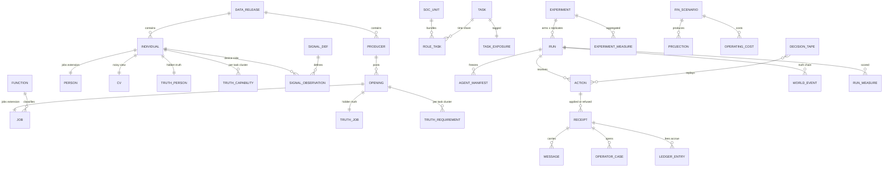

# The TinyData job ecosystem: architecture

**Owner:** `engineering-architect`. **Status:** proposed, for Soren's review before any build starts. **Companion files:** [`schema.sql`](./schema.sql) (the verified DDL), [`adr/`](./adr/) (twelve decisions), [`BUILD-PLAN.md`](./BUILD-PLAN.md), [`overview.html`](./overview.html) (one screen for Soren).

## Soren's direction, verbatim (5 October 2026)

> please put some architectural time into this. Don't let it just be me kind of doing my hey, what about this, this, that, and the other thing. This needs to have real foundational layers, it needs to have real database layers, it needs to have real kind of operating uh, approaches that we can that we can use to ask economic questions

And, added during the architecture work: "we probablky need a vault operator console".

The rest of this document is interpretation, marked as such where it goes beyond the brief.

## How to read the marks

| Mark | Meaning |
|---|---|
| **[LD]** | `docs/research/2026-10-05-uk-labour-data-grounding.md` |
| **[CH]** | `docs/research/2026-10-05-careers-and-hiring-behaviour.md` (parameter ids such as `BEH-4`, `ST-2`, `CV-3` are from here) |
| **[AE]** | `docs/research/2026-10-05-agent-environments.md` |
| **[JEV]** | `docs/research/2026-10-05-jev-decisioning-pov.md` |
| **[AS]** | `docs/research/2026-10-05-anthropic-economic-scenarios.md` |
| **[SP]** | `docs/research/2026-10-05-simon-recruitment-revenue-assumptions-v4.md` |
| **[REG]** | `docs/research/insights-and-positioning-register.md` |
| **[BR]** | `docs/brief.md` |
| **[POC]** | the careers proof of concept in the main repository, `engineering/poc` |
| **[ASM-nn]** | an assumption made in this architecture. Every one is listed in section 12 with what would replace it. |

Evidence marks inside the research files (P, S, U, E; H, M, L, A) carry through: a figure marked U or E there is still U or E here.

---

## 0. The architecture on one page

**What it is.** A synthetic, statistically grounded mirror of the UK job market in Simon's three sectors, run as an **experiment harness**: the same population is put through different market designs, agent designs, rules and AI scenarios, and every run reports the same scorecard, so the differences between runs are the findings [BR].

**Seventeen layers, in four bands:**

| Band | Layers |
|---|---|
| **Foundations** | L1 data grounding and reference data; L2 population synthesis; L3 hidden truth; L4 signals |
| **The running ecosystem** | L5 market and vault rules engine; L6 vault operations (operator role and console); L7 agents; L8 time engine; L9 AI scenarios |
| **Asking questions** | L10 experiment harness; L11 scorecard; L12 financial model |
| **Surfaces** | L13 question interface; L14 reporting and dashboards; L15 scenario planning; L16 onboarding pages for both sides; L17 the bridge to the careers PoC |

**Five decisions that carry the weight:**

1. **One writer, typed actions, a chained market log in the careers receipt format.** Agents and operators never write state. They submit typed actions; a single deterministic engine applies or refuses them; every outcome writes a receipt whose fields are the careers `AuditEvent` fields plus a hash chain. A test vector computed with the careers code's own `sha256Json` is in ADR-003.
2. **Hidden truth is walled off from the vault, in code and in the database.** Each synthetic person has a true capability, way of working and set of preferences; the CV and the work data are noisy views of it. The vault's database role cannot read the truth schema (verified). That is what makes signal value, shoehorning and fit over time measurable without the vault cheating.
3. **Three agent tiers behind one decision interface, with a decision tape.** Calibrated rules for everyone, LLM archetypes per stratum, live LLM agents on a sample of 50 to 100. Every LLM call is keyed and stored, so any run replays without calling a model. The calibrated engine carries the headline numbers; the LLM tiers are a measured perturbation, not the source of them [AE].
4. **One sampling fraction for people and jobs.** 2,000 open jobs are about 1 in 105 of the real open stock in these sectors [ASM-01]; drawing people at a different fraction would make every market impossibly tight or slack. People are drawn at the same fraction (about 87,000 structured individuals [ASM-01]), and the agreed **5,000 are the profiled tier**: full CV prose, evidence, onboarding findings, eligible as live agents. This is the main departure from the brief and needs Soren's approval (open question 1).
5. **A financial model with two modes and a failing test.** *Plan mode* reproduces Simon's workbook to the pound and fails CI if it drifts. *Ecosystem mode* replaces his assumed funnel (100 / 40 / 40 / 20 / 1) with the funnel each experiment actually produced, keeping his market volumes and levers, and adds an operating-cost line driven by the simulated operator workload.

**What comes first:** economics baseline, today's market and the vault, all at rule tier with no LLM cost (BUILD-PLAN M3), after the reference data (M1) and the first validated population release (M2).

---

## 1. Principles

1. **Distributions are sourced; records are generated.** Every parameter lives in `meta.parameter` with a research id, a confidence mark and a source. No number is typed into code.
2. **The log is the truth of what happened; the hidden truth is the truth of who people are.** Two separate chains, two separate database roles. Every measure is recomputed from them, never from agent self-report [AE pattern A].
3. **Rules are code, never prompts.** Consent, the blocked employer, the pay floor, checked claims, no paid input to a match and the operator limits are validators on the action protocol. A refusal names its rule and is itself a receipt [AE pattern A].
4. **Believable is not accurate.** The engine is calibrated to sourced targets; LLM agents are reported as a measured perturbation; every run is checked against stylised facts; investor pages show a number only with its source class and scenario [AE risk 1].
5. **Reproducible or it did not happen.** Seed, counter-based random streams, pinned data releases, pinned models, a decision tape and a final log hash. A run that cannot be replayed bit for bit is not cited.
6. **Interchangeable parts.** Population, market design, agent design, rules and scenario are each a versioned, swappable config. Nothing is hard-coded to the vault [BR].
7. **Vertical-agnostic core, vertical packs at the edge.** Jobs is the first pack; travel replaces the pack, not the core (section 2).
8. **Compatible with the careers vault, in spirit and in bytes.** Same receipt fields, same event names, same gates in the same order, same six-feature scorer as the reference arm, and an exporter to `CAREERS_SEED_DIR` [POC].
9. **Honest reporting.** Every query states rows returned against rows existing; every measure carries weighted and unweighted values, the number of replicates and a seed interval [AE pattern F].
10. **Synthetic, flagged, and impossible to confuse with real data.** `CHECK (synthetic)` on every person, employer and job; synthetic employer domains end in `.example` (RFC 2606), so no record can point at a real company's domain.
11. **Operators run the vault but cannot steer it.** They never see identities, cannot change a score or a match, act only through receipted actions, and need a second person for sensitive actions.

---

## 2. The vertical-agnostic core and the jobs vertical

The core knows about *individuals*, *producers*, *openings*, *actions*, *receipts*, *signals*, *truth*, *time*, *scenarios*, *experiments*, *measures* and *fees*. A vertical pack fills in what those mean.

| Core component | What the jobs pack supplies | What travel would replace it with |
|---|---|---|
| Reference data loader, source register, releases | SOC 2020, SIC 2007, ASHE, ONS vacancies and flows, O*NET and ESCO tasks, exposure tags [LD] | Travel reference data (passenger and booking statistics, route and inventory data) [ASM-26: not yet researched] |
| Population synthesis (raking, integerisation, validation) | Sector x function x seniority x region frame, people sized by supply [LD 11] | Traveller segments x trip type x origin region; producers (airlines, hotels, operators, OTAs) |
| Core identity tables `pop.individual`, `pop.producer`, `pop.opening` | Extension tables `jobs.person`, `jobs.employer`, `jobs.job`, `jobs.cv` | Extension tables for traveller, producer and offer or inventory unit |
| Hidden-truth framework (latent vector, noisy views) | Capability per task cluster, way of working, career preferences | Trip intent, budget, date flexibility, loyalty, true willingness to pay |
| Signal framework (`sig.signal_def` as data) | CV, calendar, documents, code, learning; maps to careers fact labels | Calendar, email confirmations, browsing; maps to travel intent labels |
| Rules engine (typed actions, validators, receipts) | Careers vault rules, today's market (boards and ATS), economics baseline | Travel vault rules from the PoC spine (Skibbit Wave, Content Wave, handshake, verified transaction record) |
| Market designs and stage maps | Candidacy, brief, handshake, reveal, interview, offer, hire | Skibbit Wave, Content Wave, handshake, consent, booking, completion; programmatic producer integration (OpenRTB-shape) |
| Vault operations framework (queues, two-person rule) | Company checks, flagged briefs, failed claims, disputed outcomes | Producer checks, flagged offers, disputed completions, refunds |
| Time engine | Monthly ticks, weekly sub-steps | Daily ticks are likely (shorter decision cycles) [ASM-26] |
| Scenario framework | AI task-exposure scenarios on roles | Demand shocks, AI agents booking on people's behalf |
| Scorecard framework | SC-01 to SC-25 (section 6) | Conversion, time to book, Engagement Number (ad spend divided by units sold) |
| Financial engine | Simon's plan v4 levers [SP] | The travel revenue plan |

The pack boundary is a TypeScript interface (`VerticalPack`) and a Postgres schema per vertical (`jobs` today). ADR-011 records the boundary.

---

## 3. System overview

```
                     experiment file (population x market design x agent design x rules x scenario, seeds, pins)
                                                    |
     +----------------------------------------------v-----------------------------------------------+
     |  RUN (one process per run, many runs in parallel)                                             |
     |                                                                                               |
     |   WORLD (td_world)                 AGENTS (td_agent)                 MARKET + VAULT (td_vault) |
     |   hidden truth, time engine,  -->  rules | archetypes | live   --->  single writer:            |
     |   scenario layer, outcomes         one decision interface            validate, apply, refuse   |
     |   (who people really are)          (sees only the observable side)   matcher, gates, receipts |
     |        |                                  ^      ^                         |     ^             |
     |        |  self-view (noisy)               |      | digests                 |     | typed       |
     |        +----------------------------------+      +-------------------------+     | actions     |
     |        |                                                                   |     |             |
     |   world chain (sim.world_event)                         market log (sim.receipt, careers shape) |
     |        |                                          OPERATORS (td_operator) -+-----+             |
     |        |                                          queues, two-person rule, no identities       |
     +--------+-------------------------------------------------------------------+-------------------+
              |                                                                   |
              +---------------------------> SCORER (td_scorer) <------------------+
                                   scorecard SC-01..SC-25, financial ledger, projections
                                                    |
                               rpt schema (td_reader: read-only)  --> question interface, dashboards,
                                                                      scenario planning, onboarding pages,
                                                                      operator console, careers export
```

**Four compartments, four database roles.** The world knows the truth and never decides market outcomes; the agents see only what a real participant could see; the vault knows only what crossed; the scorer is the only component allowed to join truth with the log, and only after the run (ADR-009). The grants that enforce this are in `schema.sql` and were tested on PostgreSQL 16: the vault role is refused on `truth.*` and on `jobs.person`; the reader role is refused on `sim.*`; the operator role is refused on case truth labels and on receipts.

---

## 4. The layers

### L1. Data grounding and reference data

**Purpose.** Load every public figure the ecosystem rests on, once, with provenance, into versioned reference releases.

**Inputs [LD 1, 14]:** APS ad hoc 3136 (SOC 2020 4-digit x SIC section), JOBS02 and BRES, ASHE Tables 14 and 15, VACS02 and X06, ONS Textkernel adverts by SOC, DfE Occupations in Demand 2025, Employer Skills Survey 2024, LFS flows X02, ONS hybrid working, O*NET 31.0, ESCO v1.2, the Anthropic Economic Index and the UK exposure work (DSIT, DfE, GLA, ILO). Simon's plan v4 [SP]. Behavioural parameters [CH].

**Design.**
- Each source is a row in `meta.source` (licence, access date, evidence mark, research section). Each loader is a pure function from a downloaded file (checksummed, stored in object storage, not in git) to rows.
- **Sector definitions** are data: `ref.sector.sic_sections`. PBS defaults to all of M and N [ASM-16] until Simon decides between that and the knowledge-work core [LD 2].
- **Function mapping** (`ref.function_soc_map`): 412 SOC units x 3 sectors with split weights, the reviewable artefact the data track asked for [LD 15]. Each function also carries a nullable `careers_role_family` for the bridge (L17).
- **Task bundles** (`ref.role_task`, `ref.task_exposure`): the chain SOC 2020 to ISCO-08 to O*NET-SOC, time shares per task, tags unchanged, augmented, automated or new with the evidence fields and the `scenario_sensitive` flag [LD 9.3].
- **Marginal targets** (`ref.marginal_target`) for raking, with a `held_out` flag for validation-only targets (Census 2021, Textkernel region mix, ESS hard-to-fill rates) [LD 12].
- **LFS and APS quality.** Use them for shares and structure, pooled 2022 to 2024; levels from JOBS02, BRES and Census; the methods note says so [LD 4].

**Output.** `ref-YYYY.MM.p` and `par-YYYY.MM.p` releases, immutable once published.

### L2. Population synthesis

**Purpose.** Generate the employer base and the individual base so they look like the real market, and prove it.

**Method [LD 11].**
1. **Frame.** Generate hierarchically: sector, then function given sector, then seniority given function, then region given sector and function. Fit each layer to official one-way and two-way marginals by iterative proportional fitting, then integerise by TRS.
2. **One sampling fraction (ADR-010).** The job frame is drawn so that about 2,000 openings are open at the reference month: about 1 in 105 of the open stock in the three sectors [ASM-01]. People are drawn at the same fraction from the in-sector workforce plus entrants, all search states included (ST-1 to ST-10 [CH 1.2]), about 87,000 structured individuals [ASM-01]. The supply and demand ratio is then an output, as the data track requires [LD 11.4].
3. **Two depths.**
   - **Structured** (everyone): identity row, hidden truth, structured CV, signal observations. Cheap, generated by code.
   - **Profiled** (5,000, the brief's number): CV prose, the evidence a CV never shows, the onboarding findings, eligible for archetype and live tiers. Stratified to oversample in-market states and rare cells (cyber in T&D, actuarial in F&I, returners, displaced, career changers), with design weights to undo it [LD 11.3, ASM-20].
4. **Floors and weights.** At least 20 jobs and 30 profiled people per sector x function cell; design weight = target share / sample share on every row; dashboards show weighted ("the market") and unweighted ("coverage") figures [LD 11.3].
5. **Employers and agencies.** About 200 producers in the working sample, sized from Simon's counts (850 large employers, 2,785 agencies) scaled down [SP], each with a synthetic company number in the careers shape and a `.example` domain. Agencies hold openings for client employers (`jobs.job.client_producer`).
6. **Attributes** drawn per [LD 11.5] and [CH]: pay from fitted ASHE quantiles by SOC x region at the seniority band; hybrid shares from ONS; tenure from LFS; notice periods (`BEH-11`); hiring pattern P1 to P6 and criticality CRIT-1 to CRIT-4 by the rules and shares in [CH 3.1, 3.2]; intents INT-1 to INT-9 with the multipliers by age, gender, level and sector [CH 1.3]; deal-breakers DB-1 to DB-8 [CH 1.4]; the person's own phrase stored beside the intent code [CH 7].
7. **AI authoring, then frozen.** CV prose, briefs' "what the employer is really looking for", employer descriptions: written by a pinned model through the Batch API from the structured record (never the other way round), stored with `author_model`, `prompt_version` and the decision-tape key. Prose never feeds back into structured state.

**Validation (release gate) [LD 12].** Weighted TVD of one-way marginals at most 0.02; SRMSE of two-way tables at most 0.1 and no large cell with abs(Z) above 1.96; ASHE deciles within 5%; rank correlation of held-out cell shares at least 0.8; seed stability (20 seeds) coefficient of variation at most 5%; Kish effective sample size reported, with a warning under 15 per cell; AI-exposure rank correlation with DfE AIOE and ILO WP140 at least 0.6. Results go to `pop.validation_result`; a release cannot reach `published` with a failing test. A recruiter face-validity panel (synthetic not distinguishable at above 60% accuracy) runs once per major release [LD 12].

### L3. The hidden-truth model

**Purpose.** Give every synthetic person and job a ground truth the market cannot see directly, so that signals, matching and fit can be scored against it.

**A person's truth (`truth.person`, `truth.person_capability`):**
- **Capability per task cluster**, not per title, in 0 to 1. Drawn from the role's task bundle (L1) with seniority, tenure and learning velocity effects, plus off-role capability for career changers and the augmented cohort.
- **Way of working:** async, collaborative, focus need, time-zone flexibility, office tolerance, comfort with regulated work.
- **Preferences:** weights over pay, progression, flexibility, manager, learning, stability, purpose and commute (sum to 1), consistent with the intent mix [CH 1.3].
- **Learning velocity, AI fluency, true reservation wage.**
- **Protected characteristics** (`truth.person_protected`): age band, gender, returner. Used only for fairness measures (SC-24); never a feature, never readable by the vault or agents' matching code [JEV 5.6].

**A job's truth (`truth.job`, `truth.job_requirement`):** the task clusters it really needs with minimum levels (which may differ from the brief's stated wants), manager quality, true remote openness, true pay ceiling, way-of-working demands, progression rate, and whether it is a fake job (adversarial arm).

**Noisy views.** The CV (`jobs.cv`) is generated from the truth by the CV parameters [CH 4.3]: material discrepancy 5% (`CV-1`), minor inflation 25% (`CV-2`), skills omitted 35% (`CV-3`, with under-claim multipliers by gender, returner and changer, `CV-4`), AI-polished text (`CV-5`). The brief is the employer's noisy view of its own job (title inflation, stated wants that miss real needs). Signals are further views (L4).

**True fit [ASM-04].** For person i and job j:
- capability fit CF(i,j) = sum over clusters k of w_jk x min(1, cap_ik / min_jk), with a penalty when any required cluster is below 70% of its minimum;
- way-of-working and preference fit PF(i,j) = 1 minus the preference-weighted distance between the person's way of working and preferences and the job's demands and offer;
- **true fit F(i,j) = CF^0.5 x PF^0.5.**

The form is deliberately non-linear with interactions, so that a linear logit in the vault cannot recover it by construction. This is the anti-circularity guard the Jev POV asks for [JEV 5.4, 7].

**Self-knowledge [ASM-06].** Agents do not see their principal's truth. The world module gives each agent a *self-view*: preferences and way of working with noise (people roughly know what they like), capability with a confidence bias that differs by group (`CV-4` direction). This is how a person can shoehorn themselves.

### L4. The signal layer

**Purpose.** Answer Soren's signal questions: which unexpected or undiscovered signals predict who can really do the job, and how are they picked up from individuals [BR, signals section].

**Signals are data** (`sig.signal_def`): channel (cv, calendar, documents, writing, code, learning, tools, claims, references), which latent variables the signal views, noise and bias, coverage (share of people for whom it exists), the person's effort in minutes, sensitivity, consent level (`none`, `confirm`, `explicit`, `never_crosses`) and the careers fact label it can draft, with a confidence threshold. The catalogue is versioned as a `signals` release; the starting rows come from the CV-against-work-data table [CH 4.2].

**How a signal reaches the market (the careers seam, in spirit).** On the person's side, observations (`sig.observation`) draft fact labels above threshold; the person's agent confirms or rejects each (confirmation probability is a parameter); only confirmed **labels** cross, exactly as the careers candidacy carries `confirmed_facts` and never values [POC]. Signals marked `never_crosses` (overload, flight risk, a bad manager) are shown to the person and never to an employer [CH 4.2].

**Which signals the vault may use** is an experiment parameter (`rules.signals_visible`), so the signal experiments (E3) can give the vault different signal sets and measure match quality, time to fill and retention against truth (SC-15).

### L5. The market and vault rules engine

**Purpose.** The single place where state changes. It implements every market design (the vault, today's market, the economics baseline, the open square) behind one protocol.

**The protocol (ADR-003).**
- **Typed actions only.** Agents and operators submit actions such as `candidacy.emit`, `claim.check`, `brief.place`, `handshake.request`, `handshake.accept`, `reveal.approve`, `outcome.report`, `message.send`, `operator.resolve_case`. Each is a Zod schema. Free text lives only in messages, never in state [AE 4.2].
- **Single writer.** Per run, one engine applies actions in a deterministic order: by sub-step, then priority class, then a seeded shuffle key (`sim.action.order_key`). Slow work (LLM calls) happens outside the engine between phases and returns as actions [AE pattern C].
- **Validators are the rules.** Each rule is a function `(state, action) -> ok | refuse(rule_id)`. A refusal writes a receipt naming the rule.
- **Receipts.** Every applied, refused or engine-originated event writes a `sim.receipt` row: the careers `AuditEvent` fields (`id` as `seq`, `at`, `actor`, `boundary`, `event_type`, `schema_ref`, `consent_ref`, `handle`, `payload_digest` computed exactly as careers `sha256Json`), plus `prev_hash` and `receipt_hash` over a canonical encoding. Event names reuse the careers ones (`seam.crossed`, `seam.refused`, `claim.verified`, `gate.failed`, `gate.validated`, `brief.placed`, `brief.withheld`, `brief.filtered`, `gate.matched`, `handshake.refused`, the handshake state events, `match.certified`, `outcome.logged`, `outcome.confirmed`). New ones follow the same `area.verb` pattern (`match.presented`, `operator.case_opened`). Monthly chain heads go to `sim.checkpoint` and, for pinned runs, to a witness store the engine cannot rewrite [AE 2.7].
- **Receipt level.** `full` writes a receipt per scored pair, as the careers vault does; `presented` (the default for seed sweeps) writes receipts for presented pairs and gates, plus one receipt per sub-step carrying the Merkle root of all pair scores, so any unpresented score can still be proven [ASM-25].

**The careers vault ruleset (`careers-vault-v1`), the reference arm.** Gates in the careers order: exclusion (salted hash of the account domain), role family, pay floor; then scoring; then handshake, reveal of at most the five permitted fields, certificate, outcomes confirmed by both sides [POC `match.ts`, `vault.ts`]. The scorer is the careers six-feature scorer (domain 0.24, level 0.20, pattern 0.16, band 0.16, sector 0.12, start 0.12) ported with a **parity test**: the same inputs give the same score as `scoreCareersFeatures`, to the hundredth.

**Rules that hold in every design that claims to be the vault:**

| Rule | Where it is enforced | Test |
|---|---|---|
| VR-01 Consent before any identity or contact crosses | `reveal.approve` validator | Property test: no `match.certified` without a prior consent receipt |
| VR-02 Blocked employer never sees the person | Exclusion gate before scoring; the request gets the same answer as "no such match" | Mutation case from careers (`current-employer`) |
| VR-03 Pay floor | Gate; offers below the floor refused | Property test over random briefs |
| VR-04 Checked claims where the role requires them | `claim.check` sets status; matcher reads only checked claims | Fabricated-claim adversary |
| VR-05 No paid input to a match | `pickScoringInput` allowlist; Q30 promotion is a separately labelled featured slot that never reorders the ranked list | Policing test: switching promotion on or adding paid fields changes no score and no rank (as careers) |
| VR-06 Reveal is at most the five permitted fields | `reveal.approve` validator | Over-scope mutation case |
| VR-07 Operators cannot change a score or a match | No action type exists for it; operator actions are validated against an allowlist | Policing test: the operator action union contains no score or match field |
| VR-08 Every event is receipted | Engine writes before state commits | Replay hash test |

**Other market designs.** `today-market-v1`: briefs posted to boards; people search with limited reach and apply (`BEH-15`); an ATS screens on the CV with validity 0.20 against an evidence screen's 0.40 (`CV-8`) and a 25% false-negative rate (`CV-6`); AI-polished CVs weaken the signal [AE 3.10]; recruiters approach passive people at `BEH-1` reply rates. `dmp-baseline-v1`: a cell-level matching function m = A x u^a x v^(1 minus a) with a between 0.5 and 0.7 [AE 3.11]. `open-square-v1`: the vault plus a public forum with caps and a maintainer that applies only proposals passing code checks (1F916 patterns, consultative input, unratified [AE 2]).

**Stage maps make designs comparable.** Each market design declares how its events map onto canonical funnel stages (enter, matched, talked, name shared, interview, offer, offer accepted, hire confirmed). The scorer only reads stages. In today's market the name is shared at the first application; in the vault only at reveal. That difference is itself a finding.

**Decision model.** `scorer-v0` (careers parity) first; then `logit-v1`, a conditional logit with an outside option ("stay where I am"), coefficients versioned as a `decision_model` release with their digest in every match receipt, ranking by the person's predicted acceptance (ADR-005, [JEV 6]).

### L6. Vault operations: the operator role and console

**Purpose.** The vault is run by TinyData staff. The ecosystem models that work, because it costs money, takes time and can become the bottleneck, and because the console's rules must be proven before anyone builds the real one. A prototype screen is being built separately at `prototype/three-sides-careers/operator.html` in the main repository; the queues and rules below use the same concepts so the two stay compatible.

**The operator's ten queues** (`sim.operator_case.queue`):

| Queue | Opened by | What the operator does | Sensitive (two-person) |
|---|---|---|---|
| `company_check` | A new producer account (KYB) | Pass, fail or ask for more | Override a failed check |
| `flagged_brief` | Brief triage: fake job, discriminatory requirement, band mismatch, spam [JEV 3] | Release, correct with the employer, or suspend | Suspend an account |
| `failed_claim` | A `gate.failed` claim check | Confirm the failure, or route to the rail for a re-check | Reverse a failure |
| `disputed_outcome` | Two sides disagree on an outcome (the careers date-mismatch refusal) | Collect both sides' evidence, decide what is recorded | Void a certificate |
| `data_request` | A person's access, correction or erasure request (by code name) | Fulfil through the device-side path | Erasure |
| `incident` | Integrity alarm, attack pattern, outage | Triage, contain, report | Any containment that blocks a producer |
| `auditor_access` | An auditor or regulator asks to inspect | Grant scoped, time-boxed, read-only access to the receipt export | Every grant |
| `rules_model_health` | Drift in match rates, calibration or fairness monitors | Raise a change request; never change a live score | Deploy a new rules or decision-model release |
| `record_integrity` | Chain verification failure, checkpoint mismatch | Investigate, attest | Any attestation |
| `fees` | Fee disputes, invoiceability questions | Explain from receipts, credit if due | Any credit |

**Design rules, enforced:**
1. **Operators never see identities.** The console is built from vault state, which holds code names and coarsened fields only; reveal values live in memory with the parties, as in careers [POC `vault.ts`]. In the database the operator role can read only `rpt.v_operator_queue`, which has no identity and no truth column (verified).
2. **Operators cannot change scores or matches.** There is no action type for it (VR-07). Rules and decision-model changes go through the release process as a new versioned release, never as an edit to a live match.
3. **Every operator action is a receipted event.** Operators submit typed actions to the same single writer; receipts carry `operator_id` and, where needed, `approver_id`. The schema refuses an `operator.*` receipt without an operator (verified).
4. **Two-person approval for sensitive actions.** A sensitive case cannot reach `resolved` without a second approver who is not the assigned operator; the database refuses it (verified), and the engine refuses it before that.

**Modelled as part of the simulation.** Operators are agents (side `operator`, rule tier by default; an LLM triage assistant is an experiment option, never the decider). Case arrivals come from market events: one company check per new producer account; flagged briefs from a triage model with precision and recall parameters applied to `truth.job.fake` and to genuine briefs (so false positives delay real hiring); failed claims from claim checks; disputes when outcome reports disagree; data requests and incidents at a rate per 1,000 candidacies [ASM-27]. Service times per case type, operator headcount, productive hours and SLAs are market-design parameters [ASM-27]. **Backlogs feed back into the market:** a company-check backlog delays a producer's first brief; held briefs wait outside matching; disputes delay fee invoiceability. Operator capacity is therefore a lever with measurable effects on time to fill and revenue timing.

**On the scorecard:** SC-25 (section 6). **In the financial model:** an operating-cost line driven by cases x handling minutes / productive hours x loaded cost, plus per-check rail costs (L12).

### L7. The agent layer

**Purpose.** Represent participants at three levels of fidelity behind one interface, and record their structure and communication as data, because "we're building an agent-to-agent economy so we want to understand how are these agents kind of working within this" [BR].

**One decision interface (ADR-004):**

```ts
interface DecisionPolicy {
  readonly tier: "rule" | "archetype" | "live";
  decide<K extends DecisionKind>(req: DecisionRequest<K>): Promise<DecisionResult<K>>;
}
// DecisionKind: market.enter | facts.confirm | exclusions.set | handshake.request | handshake.accept |
//   reveal.scope | offer.make | offer.accept | counteroffer.make | offer.renege | brief.write |
//   message.compose | operator.triage | forum.post | ...
// Each kind has a Zod result schema; an LLM answers through a tool whose JSON Schema is that schema.
```

- **Rule tier (everyone).** Calibrated hazards and logit surrogates from [CH]: transition matrix, reply rates by state (`BEH-1`, `BEH-2`), offer acceptance and fall-through (`BEH-4` to `BEH-10`), reservation wage by state (`BEH-13`).
- **Archetype tier (per stratum and decision kind).** A pinned model is asked a few dozen times per stratum with persona variation; the engine samples from the recorded distribution, and a small surrogate is fitted to it (AgentTorch and "Poor Man's Agentic Modeling" [AE 4.2]).
- **Live tier (50 to 100 agents).** Full agents with principals, memory design, tools and budgets, talking through the market design's channels. Disagreements with the surrogate are logged as "behaviour the rules miss" and become new features or archetypes.
- **Invalid output** is retried once, then the rule tier decides and the miss is counted (the EconAgent `gpt_error` lesson [AE 3.7]).

**Decision tape.** Every LLM call is keyed by sha256(model id, prompt version, decision schema version, state hash, sample index) in `sim.decision_tape`. A replay reads the tape and only a new key calls a model, so a run stays reproducible after a model is retired [AE 4.2].

**Agent profiles and messages as data.** `sim.agent_manifest` (principal, tier, provider, model, prompt version, memory design, delegation, tools, budget, strategy tags, topology slot), frozen per run. `sim.message` holds typed messages (`Search`, `Introduce`, `Message`, `Propose`, `Counter`, `Share`, `Accept`, `Decline`, `Withdraw`, `Report`, `Post`, `Comment`, `Vote`), each tied to a receipt [AE 4.3]. Each agent receives a vault-served "since you last looked" digest; its own memory is a variable [AE pattern D].

### L8. The time engine

**Ticks [ASM-03].** A tick is a calendar month (population dynamics); inside it the market runs in weekly sub-steps (four or five per month), because funnel stages move in days and time to fill is measured in days. Events are stamped to the day by a seeded draw within the week, so time measures have a resolution of about half a week.

**Each tick:**
1. **Scenario update** (L9): demand multipliers, displacement inflows, pay shifts for this month.
2. **World step** (`td_world`): arrivals (new openings per cell to hold about 2,000 open in the baseline steady state; graduates each September `ST-8`; returners, career changers and AI-displaced inflows); exits (retirement, leaving the sectors, inactivity); search-state transitions [CH 1.2]; triggers (bad manager, missed promotion, bonus season in F&I, return-to-office mandates, redundancy); internal promotions as a competing outcome (`LAD-3`, `LAD-4`); post-hire satisfaction and quits.
3. **Weekly sub-steps:** digests, decisions (rule and archetype in process; live calls in parallel with a concurrency cap), ordering, apply, matcher pass, outcome adjudication (calibrated table by default; an LLM adjudicator is an experiment arm whose outputs are validated against vault state [AE 3.4]), operator case handling.
4. **Month close:** chain heads, state hash, measure snapshot.

**Fit over time [ASM-05].** After a hire, satisfaction s_t = alpha x s_(t-1) + (1 minus alpha) x PF(i,j) + shock, with shocks from manager change, return-to-office and pay events. The monthly quit hazard rises as s_t falls below the person's threshold and as their visible outside options rise. It is calibrated so that baseline annual voluntary turnover matches `BEH-22` (15% tech, 18% PBS, 12% F&I) and first-year leavers match the pattern table [CH 3.2]. A side effect is measured rather than suppressed: better visibility can raise churn as well as fit.

**Backfills are feeders.** Every exit can open a backfill brief at the employer; this links tenure on one side to demand on the other (SC-09).

### L9. The AI-scenario layer

**Purpose.** Model where the market is going, not only where it is [BR].

**Inputs.** The explorer's five: capabilities C, adoption D, autonomy U, productivity P, adjustment J [AS]. Presets modest, substantial and extreme, plus a custom setting. Per-scenario input values are in Korinek et al. (2026), which has not been read [LD 9.4]; until then presets are calibrated to the UK displacement envelopes the data track proposes (modest near TBI and Skills Imperative magnitudes, substantial near IPPR central, extreme near IPPR worst) [ASM-13].

**Translation per role, per month [LD 9.4]:** displaced work share = A_r x C x D(sector) x U; augmentation saving = G_r x D x (P minus 1) / P, partly re-absorbed by sector demand elasticity; net demand shift = baseline projection growth minus displacement minus unabsorbed saving plus N_r x D; adjustment time scaled from LFS exit rates. A_r, G_r, U_r and N_r are the role's automated, augmented, unchanged and new task shares from L1.

**What it changes:** opening inflow per cell; cancellation of CRIT-4 vacancies (`CRIT-5`: 20%, 40%, 65%); entry-level demand (-10%, -30%, -60%); the AI-displaced inflow (`ST-10`: 0.5%, 3%, 8% stock by 2030); re-employment hazards and pay at re-entry (`AI-1` to `AI-8`); the move premium (`BEH-12`: +10%, +6%, +2%); the weight employers put on AI fluency (`SCR-12`); the mix of new, redesigned and shrinking roles (`NEW-1` to `NEW-3`); task tags flagged `scenario_sensitive` [CH 2.4, 3.7].

**Check:** the role ranking on A + G correlates with DfE AIOE and ILO WP140 at rho of at least 0.6, disagreements listed [LD 9.3].

### L10. The experiment harness

**The experiment file (ADR-006)** is YAML, validated by Zod, canonicalised to JSON and content-addressed (its hash is the `experiment_id`):

```yaml
experiment: e2-vault-vs-today
version: 1
question: "Does the vault beat today's market on time to fill, fit and cost per hire?"
population: { reference: ref-2026.10.0, parameters: par-2026.10.0, release: pop-2026.10.0, signals: sig-2026.10.0 }
horizon: { start: 2026-11, months: 24, warmup_months: 6 }
seeds: { base: 20261005, replicates: 20, common_random_numbers: true }
base:
  market_design: { kind: careers-vault-v1, consideration_set: 5, caps: { introductions_per_week: 10 } }
  agent_design: { tiers: { rule: all }, memory: none, topology: bilateral_vault }
  rules: { decision_model: scorer-v0, signals_visible: [cv_labels, claims], ranking_promotion: off }
  operators: { headcount: 3, productive_hours_per_week: 30, triage: { precision: 0.8, recall: 0.7 } }
  scenario: { ai: baseline }
  economics: { fee_schedule: flat-1850-promo-off, route_split_direct_pct: 30 }
arms:
  - name: vault
  - name: today
    override: { market_design: { kind: today-market-v1 } }
  - name: dmp
    override: { market_design: { kind: dmp-baseline-v1 } }
scorecard: standard-v1
receipts: presented
budget: { llm_usd_max: 0 }
pins: {}
```

- **Arms are overrides on a base**, so every comparison is paired. **Common random numbers:** arm A and arm B with replicate r share the seed and the random streams, which cuts the variance of differences.
- **Random streams are counter-based and keyed** by (seed, stream name, entity id, tick), so adding a random draw in one module never shifts another module's draws.
- **Twenty replicates** by default, from the seed-stability target [LD 12]; results show means and 95% intervals, and paired differences with their own intervals [ASM-23].
- **Warm-up months** are discarded before measurement, so starting conditions do not drive results.
- **Budget** is a hard stop: estimated before the run from `meta.model_price`, checked during it, logged after (`sim.run_cost`).
- **Stylised-fact checks** run on every arm: matching-function elasticity on unemployment in 0.5 to 0.7, a Beveridge curve, open stock within 5% of 2,000 in the baseline [AE 3.7, 3.11]. Failures are printed on the run report.

**From result to register.** A register row [REG] moves from *Claim* to *Modelled* only when a pinned experiment shows the effect in the claimed direction with a seed interval excluding zero, the rule and archetype tiers agree in direction, stylised facts pass and the run replays. `rpt.insight_evidence` records the test; Soren ratifies the status change. *Modelled* is never presented as *Evidence* or *Tested*.

### L11. The scorecard

The standard scorecard (`standard-v1`) has 25 measures with exact definitions; section 6.

### L12. The financial model

**Two modes (ADR-012 covers releases; the financial design is here).**

- **Plan mode** reproduces Simon's workbook. Its inputs and outputs are loaded cell by cell into `fin.plan_v4_cell`; the model recomputes every output from the inputs; the **reconciliation test** compares each output cell and fails CI on any difference above tolerance (zero for per-hire figures, £1 for totals) [ASM-28]. Known anchors it must hit [SP]: cost per hire £2,390 direct and £910 agency (with ranking promotion on and percentage fees: £120 job waves + £240 promotions + £120 handshakes + £60 consents + £1,850 or £370); £6,475 baseline; 63% saving direct; £6,845 combined agency; three-year revenue £12.62m direct and £9.77m agency, £22.4m system. **Our summary has only the headline figures; the workbook export is needed for the cell-level test** (open question 2).
- **Ecosystem mode** keeps Simon's market volumes, route split, producer ramp, seat tiers and entity split, and replaces the funnel ratios with the ones an experiment arm produced (SC-07), with their seed intervals carried through to revenue intervals. Fees accrue in `fin.ledger_entry` only from receipted events; UK projection = modelled rate per hire x Simon's UK hires per sector x attributable share x ramp.

**Levers, all adjustable [SP, POC economics.ts]:** hire fee mode (Q29: flat, default £1,850 illustrative; or percentage, 5% direct and 1% agency), per-event fees (£3, £3, £3, £6), ranking promotion (Q30, off by default, never read by the matcher), route split (30/70 or 20/80, flagged inconsistent in the sheet), producer ramp, seat tiers (£1,999, £4,999, £8,999), attributable share, ad hoc projects (£5,000), data collaboration (£10,000 a year), entity split (Skibbit Ltd 100% of SaaS and ad hoc; transaction fees 25% VaultCo, 75% sector vaults).

**Operating cost (from L6).** `fin.operating_cost`: operator staff (cases x minutes / productive hours x loaded cost), company checks and claim rails (checks x unit price), infrastructure, LLM, audit. All illustrative until priced [ASM-27]. Contribution after operating cost is reported beside revenue, so a fee level that only works with no one running the vault is visible.

**Reprice or rerun.** Levers that do not change behaviour (fee levels, Q29 mode, seat prices, entity split, revenue route split) **reprice** an existing run's ledger instantly. Levers that change behaviour (market design, rules, signals, AI scenario, operator capacity, Q30 when a featured slot attracts attention) need a **rerun**. The UI says which.

**Outputs:** revenue by stream and entity by month, cost per hire against £6,475, TinyData take, operating cost and contribution; base, low and high; sensitivity on the five biggest levers; spreadsheet export laid out beside Simon's plan.

### L13. The question interface

**Purpose.** Ask in plain English; get a table or chart with the exact query shown [BR].

**Flow (ADR-008):** question, then Claude (pinned model) with a system prompt holding the semantic layer (the `rpt` views, every measure definition from `rpt.measure_def`, worked examples), then a `run_query(sql)` tool call, then **checks**: parse to a Postgres AST; exactly one `SELECT`; relations only from the `rpt` allowlist; functions only from an allowlist; no system catalogues; a `LIMIT` imposed; then execution as `td_reader` (no grants outside `rpt`, `default_transaction_read_only = on`, `statement_timeout = 10s`) inside a read-only transaction; the total row count is fetched beside the rows. The answer shows the SQL, rows returned against rows existing, the experiment and arms it read, each measure's source class, and the standing caveat that the data is synthetic and scenario-based.

**A second tool, `propose_scenario`,** turns a what-if ("what does a flat £1,850 fee do to year-3 revenue?") into an experiment-file diff or a reprice request **shown to the person**; Claude never starts a run. Free-text columns (CV prose, agent messages) are not in `rpt`, so authored text cannot inject instructions. Every question is logged in `qi.question_log`. An evaluation set of 100 questions with gold queries gates every prompt or model change at 90% result equivalence [ASM-29].

### L14. Reporting and dashboards

Standing pages, all reading `rpt`: run scorecard; arm comparison with paired differences; funnels from both sides against 100 / 40 / 40 / 20 / 1; feeder funnels (inflow sources and drop-out reasons, as Sankey charts); supply and demand by sector x function x pattern; time-to-fill survival curves; fit, tenure and shoehorning; signals; scenarios; financials; **operator queues and workload**; event-log explorer with a "verify chain" button and the careers projection; population browser (filter by sector, role, pattern; open a profile, its CV and what the CV misses, from truth minus CV); a one-page readout per run. Charts are Vega-Lite specs (data, versioned, reproducible). Exports: CSV, XLSX laid out for Simon, PDF readouts. Every number shows its source class, run or experiment id, replicate count and interval.

### L15. Scenario planning UI

Levers grouped as market design, rules (signals visible, remote openness, floor enforcement, consideration set), operators (headcount, triage strictness), AI scenario, fees (Q29, Q30), routes, producer ramp and funnel source (plan or modelled). Each lever is marked reprice or rerun; a rerun shows its cost estimate and time before it is queued. Named scenarios are saved and compared up to four side by side: revenue by stream, cost per hire against £6,475, TinyData take, contribution, cash, match and fit measures. Presets base, low and high; a tornado chart for the five biggest levers. People can scenario-plan too: the same page has a person-side view (time to the right next role, roles that fit, demand for people like them) under each setting [BR].

### L16. Onboarding pages for both sides

**Individual onboarding** (in step with the Skibbit redesign): choose a synthetic profiled persona (no real CV upload in the first deliverable [ASM-30]); see what the CV and the work signals find, including what the CV never says (truth against CV for that persona); confirm or reject each finding; state wants (floor, location, availability, who must never see you); then **where you stand**: roles that fit now from the latest pinned vault run, demand for people like you (open briefs and the supply and demand ratio in your cell), and expected time to match (survival median for your stratum), each with its source.

**Employer onboarding** (TinyData black-and-white system): company check (simulated, opens a `company_check` case so the queue is visible); place a structured brief; then **the market for this role**: how many people fit (weighted to UK scale), how scarce they are, expected time to fill, and cost per hire against the agency route from the financial model. A free-text brief is out of scope until brief intake is decided [JEV 3].

### L17. The bridge to the careers PoC

- **Seed export.** `td export careers --release pop-... --out <dir>` writes the `CAREERS_SEED_DIR` layout that `jsonDirCareersSeedSource` reads: `employers.json`, `briefs.json`, `claim-register.json` and `personas/*.json`, each validated against the careers schemas (vendored as JSON Schema at a pinned careers contract version) [POC `seed-source.ts`]. Profiled people become personas with device-side `sources` generated by the signal layer, draft `facts` with evidence ids, `confirmations` and `go_to_market` fields; brief ids follow `BR-\d{3,6}`; domains end in `.example`.
- **Vocabulary mapping.** Sectors (3) and location bands (8) are identical. Seniority maps from L1 to L8 onto the eight-rung careers ladder. Facts map onto the 25 careers fact labels. Role families: careers has 9 (`product`, `engineering`, `data`, `consulting`, `legal`, `audit`, `risk`, `underwriting`, `compliance`); functions without a family are not exported and are counted in the export report, until careers extends the enum additively [ASM-21].
- **Receipts.** `td export receipts --careers` projects the market log onto careers `AuditEvent` rows (dropping the extension columns, mapping `seq` to `id`); a careers-side verifier re-derives every `payload_digest`. Operator events project with actor `system` until careers adds an `operator` actor (open question 9).
- **Decision model.** Logit coefficients are exported in a form the careers `MatchEngine` seam can load later [JEV 6].

---

## 5. The data model

### 5.1 Entities and relationships



### 5.2 Schemas

| Schema | Holds | Readable by |
|---|---|---|
| `meta` | Sources, parameters, data releases, dated model prices | All component roles |
| `ref` | Reference data for the jobs pack | All component roles |
| `pop` | Vertical-agnostic identities, validation results | World, agents, scorer |
| `jobs` | Jobs extension tables: person, employer, job, CV, CV prose | World, agents, scorer; the vault reads only `jobs.employer` (accounts) |
| `truth` | Hidden truth and protected characteristics | World and scorer only |
| `sig` | Signal catalogue and observations | World, agents, scorer; the vault reads only the catalogue |
| `sim` | Experiments, runs, manifests, actions, receipts, world events, messages, operator cases, checkpoints, decision tape, run cost | Engine roles write; scorer reads |
| `fin` | Fee schedules, ledger, plan v4 cells, scenarios, projections, operating cost, reconciliation | Scorer |
| `rpt` | Measure definitions, run and experiment measures, insight evidence, views | Reader (question interface, dashboards); operators see only the queue view |
| `qi` | Question log | Owner |

The full DDL is in Appendix A and in [`schema.sql`](./schema.sql) (54 tables in 10 schemas, plus four views, triggers and grants). It was executed on PostgreSQL 16 in an empty database, with these checks passing:

- inserts across releases, population, a run, a per-run receipt partition and a ledger entry with a foreign key into the partitioned receipt table;
- an update to a receipt is refused (append-only trigger);
- the vault role is refused on `truth.*` and `jobs.person`, and can read reference data;
- the reader role is refused on `sim.*` and cannot write;
- a non-synthetic person, a candidate fee other than £0, and a refusal receipt without a rule are refused by constraints;
- a sensitive operator case resolved by one person is refused, and resolved by two distinct operators is accepted; operator cases cannot be deleted; the operator role cannot read truth labels or write receipts; an `operator.*` receipt without an operator is refused;
- retention detaches and drops a run's partition.

### 5.3 Volumes and partitioning [ASM-25]

A 24-month run at the `presented` receipt level writes in the order of 1 to 3 million receipts and a similar number of world events (estimate: about 90,000 people, about 2,000 open jobs, weekly sub-steps). `sim.action`, `sim.receipt`, `sim.world_event`, `sim.message` and `sim.operator_case` are **list-partitioned by run**: the engine creates a run's partitions at start, and retention detaches and drops them. **Pinned** runs (named experiments, anything cited) keep their logs; **standard** runs (seed sweeps) keep the scorecard, the checkpoints and a Parquet archive of the log, and drop the partitions after 30 days [ASM-14]. Cross-run analysis reads the Parquet archive with DuckDB.

### 5.4 Migrations strategy

- **Forward-only, plain SQL**, numbered (`db/migrations/0001_meta.sql` ...), checksummed in a migrations table, each applied in a transaction by a small runner. An applied migration is never edited.
- **Expand, then contract.** Add the new column or table, backfill, switch readers, then drop the old one in a later migration.
- **`sim.run.schema_version`** records the schema every run was written under; the scorer refuses to compare runs across incompatible versions.
- **CI** applies every migration to an empty database and to a snapshot of the last published release, then runs the grant and constraint tests above.
- **No down-migrations;** recovery is by restore from backup (point-in-time recovery on the managed database).
- **Typed access** through Kysely, with types generated from the live schema; a CI check fails if the generated types differ from the committed ones.

### 5.5 Versioned data releases

- **Kinds:** `reference`, `parameters`, `population`, `signals`, `decision_model`. **Ids:** `<kind>-<YYYY.MM>.<patch>`, for example `pop-2026.10.0`.
- **Immutable once published.** The release id is part of every primary key in release-scoped tables, so a new release never mutates an old one.
- **Contents:** the database rows, a canonical export (Parquet and CSV), a manifest with the content hash, the generator commit and seed, the parent release, and the validation report.
- **Lifecycle:** `draft`, `validated` (all release-gate tests pass), `published` (Soren or a named reviewer signs), `withdrawn` (kept for replay, never used for new runs).
- **Semantics:** a patch fixes defects without moving validated distributions beyond tolerance; a new month re-fits to new reference data. Every run pins all its releases.

---

## 6. The standard scorecard (`standard-v1`)

**Conventions.** A **candidacy** is a person's spell in the market: it starts at the market design's *enter* stage and ends at a confirmed hire, withdrawal or the horizon (censored). A **brief** is an opening's spell from *placed* to filled, cancelled or the horizon. Stages come from the design's stage map (L5), so every measure is defined once for every design. Durations are in days and estimated with Kaplan-Meier where censoring exists. Every measure is reported **weighted** (design weights, "the market") and **unweighted** ("coverage"), per run and per arm across replicates with a 95% seed interval, and as a paired difference against a named arm. Cuts: sector, function, seniority, region, hiring pattern, route, search state, intent, AI cohort, month. Source class: `log` (computed from receipts), `truth` (from hidden truth), `log+truth`, `financial`, `plan`.

| Id | Measure | Exact definition | Source class |
|---|---|---|---|
| SC-01 | Match percentage, candidacy side | Of candidacies whose *enter* falls in the measurement window and which have at least 90 days of follow-up, the share with at least one *matched* stage event (a `match.presented`) within 90 days of entry. Also reported by horizon. | log |
| SC-02 | Match percentage, brief side | Of briefs placed in the window with at least 30 days of follow-up, the share presented to at least one candidacy within 30 days. | log |
| SC-03 | Time to match | Days from *enter* to first *matched* event (candidacy side) and from *placed* to first presentation (brief side); Kaplan-Meier median and interquartile range. | log |
| SC-04 | Time to fill and time to start | Time to fill: days from brief *placed* to *offer accepted* (the [CH 3.2] definition, requisition to accepted offer). Time to start: days to the start date, which adds the notice period (`BEH-11`). Kaplan-Meier medians; briefs cancelled are censored at cancellation and also counted separately. | log |
| SC-05 | Supply and demand ratio | **Observed:** for cell c at month t, the number of open candidacies compatible with at least one open brief in c on stated filters (function or permitted adjacent family, level within one rung, location or remote feasibility, floor at or under the band maximum), divided by the number of open briefs in c. **True:** the mean over open briefs j in c of the number of in-market people (ST-2 to ST-10) who are truly qualified (capability at or above every required minimum) and feasible for j. Flags: true ratio under 1 is *scarce*; under 0.5 *hard to find*; above 3 *abundant*; compared with the pattern table's 3.0 / 2.0 / 1.5 / 0.6 / 0.3 / 8+ [CH 3.2]. | log, log+truth |
| SC-06 | Funnel, person side (conversion) | Of distinct people who entered the market in the window: shares reaching matched, talked (handshake accepted by the person), name shared (reveal approved), interview, offer, offer accepted, hire confirmed. Each stage also as a conditional rate on the previous stage. | log |
| SC-07 | Funnel in Simon's units | Per 100 intent waves (a candidacy emission, `seam.crossed` of a candidacy; rotations count again): job waves (briefs presented to candidates), ranking promotions (featured presentations; zero when Q30 is off), handshakes (handshake requests reaching `offer_presented`), consents (`consent_granted`), hires (confirmed). Reported beside Simon's 40 / 40 / 40 / 20 / 1 with the ratio of each [SP, ASM-08]. | log |
| SC-08 | Funnel, employer side | Of briefs placed in the window: shares with at least one match, at least one handshake requested, one accepted, one name shared, one interview, an offer, an accepted offer, a confirmed hire. | log |
| SC-09 | Feeder funnels | **Person side:** candidacy entries by origin (search state at entry, the trigger that moved them, channel: vault invitation, board, referral, agency approach, internal) and exits by stage and reason code (withheld, below floor, declined under mandate, ghosted, reneged, counteroffer accepted, withdrawn, censored). **Employer side:** briefs by origin (new requisition, backfill from an exit, growth, AI-redesigned role, route) and exits by reason (filled in market, filled outside or internally, cancelled under `CRIT-5`, expired, held by an operator). Counts and shares per 100 entries. | log |
| SC-10 | Contracts completed | Hires with an accepted offer, no renege, the start date reached and, in the vault, the hire outcome confirmed by both sides (`outcome.confirmed`, kind hire). Unweighted count, and weighted to UK scale. | log |
| SC-11 | Shoehorning rate | A hire of person i into job j at time t is **shoehorned** when the true fit F(i,j) is under 0.6 **and** some job j' open within 30 days of t, feasible for i (floor, deal-breakers, location or remote), had F(i,j') at least 0.15 higher [ASM-04]. Rate = shoehorned hires / hires. Split into **unseen** (j' never presented or visible to i) and **seen** (visible but not pursued or not achieved). The unseen share is the direct test of I3. | log+truth |
| SC-12 | Fit at hire | Mean and distribution of F(i,j), CF and PF over hires; share of hires with F of at least 0.75. | log+truth |
| SC-13 | Retention, tenure and satisfaction | 12-month retention: Kaplan-Meier survival at 365 days from start for hires starting in the window. Median tenure (Kaplan-Meier). Mean satisfaction s_t at 6 and 12 months. Regretted exits: quits within 12 months with F at hire of at least 0.75. | log+truth |
| SC-14 | Match quality against the oracle | Each month: mean F of hires made, divided by the mean F of an oracle assignment of the same number of hires (maximum-weight matching on F over feasible pairs of in-market people and open briefs). 1.0 is perfect. | log+truth |
| SC-15 | Signal value | For a signal set S against a baseline set B (same seeds): (a) recovery, the Spearman correlation between the vault's ranking score and F over presented pairs; (b) top-5 precision against the true top 5 feasible; (c) outcome differences in SC-04, SC-11, SC-12 and SC-13; (d) cost to the person in minutes and sensitivity. Per-signal value is leave-one-out within S; grouped Shapley values over at most eight signal groups. | log+truth |
| SC-16 | Visibility and distance | Share of hires outside the person's region or remote; mean commute; the difference in SC-11, SC-12 and SC-04 between geography settings (own region, national, national plus remote). | log+truth |
| SC-17 | Time to the right next role | For people entering ST-6, ST-9 or ST-10: days from entry to the start of a role with F of at least 0.6; Kaplan-Meier median, by age band and scenario. The scenario layer's headline measure [AS]. | log+truth |
| SC-18 | Cost per hire against £6,475 | Per route: (TinyData fees on the funnel events attributable to hires on that route, plus allocated seat licences) / confirmed hires; on the agency route, plus the agency fee (hire salary x 17.5% by default [SP], `AG-4` range for sensitivity). Compared with £6,475 [SP] and with a salary-matched baseline (each hire's salary x 17.5%). In today's market: agency fee for agency hires, and the CIPD medians for direct hires (`AG-5`, unverified). | financial |
| SC-19 | Revenue by stream | Sum of ledger entries by stream (job wave, ranking promotion, handshake, consent, hire fee) per month, route and sector; UK-scaled projections add seats, ad hoc projects and data collaboration (L12). | financial |
| SC-20 | TinyData take | **Take:** revenue to the TinyData entities (assumed: Skibbit Ltd, VaultCo and the sector vaults [ASM-09]). **Take rate:** TinyData revenue on hires divided by what those hires would cost at today's baseline (the salary-matched agency fee). At plan figures that is 37% direct (£2,390 / £6,475) and 14% agency (£910 / £6,475). | financial |
| SC-21 | Rule integrity | Refusals per 1,000 actions by rule; attack attempts by type; **attack success rate** = breaches found by an independent invariant checker over the log (a reveal outside the five fields, a presentation to an excluded employer, a presented brief under the floor, a rank change that correlates with a paid flag, an operator action without a required approver) / attempts. Target: zero. | log |
| SC-22 | Cost of talk | Messages and tokens per hire; share of threads ending at a cap rather than a decision; first-offer acceptance rate; share of hires brokered by a third agent [AE 4.3]. | log |
| SC-23 | Unserved intents and unseen demand | Share of in-market people by primary intent with no feasible open brief serving that intent; for each profiled person, the count of open briefs with F of at least 0.6 they were never shown (tests I4). | log+truth |
| SC-24 | Fairness | Match percentage, hire rate per candidacy, time to match and F at hire by gender, age band and returner status, as ratios to the reference group, with a four-fifths flag. Synthetic, for detecting bias the rules or models introduce [JEV 5.6]. | log+truth |
| SC-25 | Operator workload and queue health | Per queue: arrivals per 1,000 briefs and per 1,000 candidacies; backlog at month end; median and 90th-percentile time to resolve; SLA breach rate; company-check backlog in days; fraud flags per 1,000 briefs with **precision and recall against `truth.job.fake`**; dispute rate per 100 hires; share of sensitive actions with two-person approval (must be 100%); operator hours and FTE required; operating cost per hire. | log, log+truth |

Every measure has a reference implementation in the scorer (TypeScript) and a unit test on a hand-built toy log with a hand-computed answer.

---

## 7. The first experiment set

All on the same frozen releases, 20 replicates, common random numbers, 6 warm-up months and 24 measured months, scorecard `standard-v1`.

| # | Experiment | Arms | What it answers | Register rows it can move [REG] | Tier and LLM cost |
|---|---|---|---|---|---|
| **E0** | Economics baseline | `dmp-baseline-v1` per cell | Does the engine reproduce labour-market theory (elasticity 0.5 to 0.7, Beveridge curve) and the sourced time-to-fill targets? A sanity check, not a product claim | none | Engine, $0 |
| **E1** | Today's market | `today-market-v1` with AI-polished CVs into ATS bots, boards, agencies | The baseline TinyData must beat; the "more applications, less real finding" dynamic | I6 (direction), I12 needs primary data | Rule, $0 |
| **E2** | The vault | `careers-vault-v1` with `scorer-v0`; then `logit-v1` | Match percentage, time to fill, fit, shoehorning, cost per hire, operator workload, against E1 and E0 | B2, P4, P5, I4, I8 | Rule, $0 |
| **E3** | Signals | E2 with signal sets S0 (CV labels), S1 (+ checked claims), S2 (+ calendar ways of working), S3 (+ code and documents), S4 (+ learning velocity), S5 (all crossable) | Which signals recover who can really do the job, at what cost to the person | P1, P2, P3, I7 | Rule, $0 |
| **E3b** | Visibility and distance | E2 with own region, national, national plus remote | The value of wider visibility; far jobs open to remote work | I5, I3 | Rule, $0 |
| **E4** | Adversarial | E2 and E1 with 5% fake jobs, fabricated claims, spam agents, Q30 featured slot on, prompt injection in brief text (live tier), impersonation in the open square | Whether trust holds; the cost of Q30; operator load under attack | P3, P6 | Rule plus a live sample |
| **E5** | Capability mix | Live sample with cheaper against frontier models on either side | Whether richer agents win unfairly at equal true fit; what the vault must protect | P8 (partly) | Live |
| **E6** | Open square | `open-square-v1` with caps and a maintainer | Emergent norms, what agents ask of the platform, abuse in public (1F916 patterns, consultative input) | none directly | Live |
| **E7** | AI scenarios | E1 and E2 x baseline, modest, substantial, extreme | Volume, time to the right next role, cost per hire as the market moves | B1, I8 | Rule, $0; archetype refresh per scenario |

**Before any live-tier result is cited**, the fidelity ladder (rule only, archetypes, archetypes plus live sample) runs on E2 to learn which measures depend on LLM behaviour at all [AE 3.10]. A sensitivity arm that varies only scheduling order and prompt framing is attached to every live experiment; large effects there are flagged as artefacts [AE 3.10, Li and Tao].

---

## 8. Tech stack, with reasons

| Choice | Reason |
|---|---|
| **TypeScript 5, strict, on Node 22 LTS, ESM; npm workspaces** (ADR-001) | Matches the careers PoC (`strict`, `noUncheckedIndexedAccess`, Zod, Vitest), so contracts, the scorer port and the exporter share one language and two engineers work in one toolchain. The numerics needed (raking, integerisation, conditional logit by Newton-Raphson, Kaplan-Meier, the Hungarian algorithm) are small and testable in TypeScript; they are verified against reference vectors computed once with standard Python libraries and committed as fixtures. Python never runs in production. |
| **Zod at every boundary**; JSON Schema emitted for experiment files | Same discipline as careers; editors autocomplete experiment files. |
| **PostgreSQL 16, managed, UK or EU region** (ADR-002) | Real constraints, roles and grants (the firewall lives in the database as well as in code), list partitioning per run, foreign keys into partitioned tables, mature point-in-time recovery. Verified locally. |
| **Kysely** with generated types | Typed queries without an ORM hiding the SQL the question interface must also see. |
| **DuckDB over Parquet archives** | Cheap cross-run analysis without loading dropped partitions back into Postgres. |
| **Fastify API, React with Vite web app, Vega-Lite charts** | Fastify matches the careers registry. Vega-Lite specs are data, so charts are versioned and the question interface can return one. |
| **Anthropic TypeScript SDK; a provider interface for other models** | Claude for authoring, archetypes, live agents and the question interface; other providers only behind the same interface for the capability-mix arm. Message Batches for authoring and archetype elicitation; prompt caching for live agents and the question interface. |
| **Counter-based random streams** | Keyed by (seed, stream, entity, tick), so runs are reproducible and arms share draws. |
| **ExcelJS and Playwright** | XLSX for Simon; PDF readouts printed from the report pages. |

**Testing.** Vitest unit tests for every rule and every financial calculation; property tests (fast-check) for the vault rules; the scorer parity test against careers `scoreCareersFeatures`; the receipt compatibility test (ADR-003 vector); **policing tests** (no paid field reaches the matcher; the operator action union has no score or match field; the vault module cannot import truth modules, enforced with dependency-cruiser; the vault database role cannot read truth); the **replay determinism test** (a recorded run replayed from seed and tape gives the identical final receipt and world hashes); the **plan v4 reconciliation test**; population release-gate tests; measure tests on toy logs; question-interface safety tests (DDL, DML, catalogue access, multiple statements, long queries all refused).

**CI (GitHub Actions).** On every pull request: typecheck, lint, unit, property, policing, migrations on an empty database and on the last release snapshot, grant tests, scorer parity, receipt compatibility, reconciliation, a 3-month smoke run with replay hash. Nightly: a 24-month E2 run at five seeds; the question-interface evaluation (under a spend cap). On a release tag: the full population validation suite.

**Reproducibility.** A run is the tuple (experiment hash, arm, replicate, seed, five release ids, code commit, schema version, model pins). The decision tape makes any LLM-touching run replayable with no API calls. Pinned runs' monthly chain heads are written to a witness store outside the database.

**Model pinning and cost controls.** Exact dated model ids, never aliases, recorded per agent manifest and per run. Prices in `meta.model_price` with an effective date. Pre-run estimate, hard budget stop, post-run actuals in `sim.run_cost`.

**LLM cost estimates [ASM-11, ASM-12].** Prices as cached in the agent-environments research on 25 September 2026 (U, check the live page): Claude Haiku 4.5 $1 / $5, Claude Sonnet 5.5 $2 / $10, Claude Opus 5.5 $4 / $20 per million input / output tokens [AE 4.2].

| Workload | Volume | Haiku 4.5 | Sonnet 5.5 | Opus 5.5 | Frequency |
|---|---|---|---|---|---|
| Rule-tier run (E0 to E3, E3b, E7) | 0 calls | $0 | $0 | $0 | Every run |
| Live tier, 100 agents x 24 months x 10 decisions (3,000 in, 500 out) | 72M in, 12M out | $132 | $264 | $528 | Per live run, before caching [AE 4.2] |
| Same, with prompt caching on two-thirds of input (cache reads at a tenth of the input price [U]) | | about $89 | about $178 | about $355 | Per live run [E] |
| Archetype elicitation, 200 strata x 6 decisions x 30 samples | 108M in, 18M out | $198 (about $99 batched) | $396 (about $198 batched) | | Per population release and model pin |
| Population authoring, 5,000 CVs and about 2,200 briefs and employers (1,500 in, 2,500 out) | 10.8M in, 18M out | $101 (about $50 batched) | $202 (about $101 batched) | | Per population release |
| Question interface, per question (two calls, about 12k in mostly cached, 1.5k out) | | | about $0.03 to $0.08 | | Per question |

Note: the agent-environments research describes the archetype refresh as "roughly a quarter of one Haiku live run"; the arithmetic above (36,000 calls at 3,500 tokens) gives about 1.5 times a Haiku live run before batching. The table uses the recomputed figure.

---

## 9. Security and privacy

- **All synthetic, enforced.** `CHECK (synthetic)` on individuals, producers and openings; synthetic company numbers in the careers shape; `.example` domains; generated names checked against a list of real company names (Companies House bulk data [U]) so no synthetic employer shares a real name.
- **No real personal data, anywhere.** No CV upload, LinkedIn import or real employer data in the first deliverable. The onboarding pages run on synthetic personas. Any real-data feature waits for `privacy-counsel` [ASM-30].
- **The firewall, rehearsed.** The same separation the real product needs (the vault knows only what crossed; operators never see identities; protected characteristics are never features) is enforced here in code and in database grants, so it can be shown and tested before real data exists.
- **Claude sees synthetic aggregates only.** The question interface reads `rpt`; it never sees prose or messages.
- **Secrets.** API keys in the host's secret store; one key per environment, spend-capped; never in the repository.
- **Access.** Soren and the team as owners; Simon read-only on dashboards and exports from M4; Kingston and the wider team at release 1.0 [BR decisions].
- **Licences.** Learn from 1F916 (AGPL-3.0) and the unlicensed repositories; copy no code [AE 6]. Adzuna data only within its terms; nothing stored verbatim [LD 6].

---

## 10. Out of scope for the first deliverable

- Real personal, employer or advert data of any kind; CV upload; LinkedIn import.
- Licensed postings data (Lightcast, Textkernel), unless time to fill becomes load-bearing for investor material [LD 15].
- The primary survey and interviews [CH 7] (planned separately; the ecosystem will take their results as parameters).
- Jev or the Decisions API in the loop (the proof plan in [JEV 7] can run on this ecosystem later).
- Free-text brief intake; on-device inference; real claim rails; real company checks.
- EU and US markets; travel and other verticals (the core is built for them; the packs are not).
- Live tier above 100 agents; the scale ladder above 100.
- A production operator console for the real vault (the ecosystem's console view and the separate prototype screen inform it).
- Multi-tenant external access beyond named collaborators.

---

## 11. Risks, and how the design answers each

| Risk | Why it matters | Design answer |
|---|---|---|
| **Believable is not accurate** | LLM agents produce plausible behaviour that need not match people; investors' analysts will ask what the numbers rest on [AE risk 1] | The engine carries the headline numbers and is calibrated to sourced targets; LLM tiers are a measured perturbation (fidelity ladder); stylised-fact checks on every arm; held-out validation; source class on every number; *Modelled* never shown as *Evidence* |
| **Circularity** | A logit fitted to data a logit generated only recovers our assumptions [JEV 5.4] | The truth model is non-linear with interactions; labels also come from live agents who see information outside the six features |
| **Reproducibility** | Model retirement and non-determinism break replays [AE risk 2] | Seeds, counter-based streams, pinned releases and models, decision tape, replay hash test in CI |
| **Agents manipulating agents** | Prompt injection redirected payments in Magentic Marketplace; scams in 1F916 [AE risk 3] | No rule in a prompt; typed actions; free text never in state; matcher allowlist; adversarial arm and invariant checker (SC-21) |
| **Operators steering outcomes** | A console is a back door if it can touch matches | No action type for scores or matches; two-person rule in code and schema; every operator action receipted; no identities in the console |
| **Data gaps** | Function shares, time to hire, passive openness, notice periods and UK task usage have no clean source [LD 13, CH 7] | Every such parameter is marked E or A with a range; sensitivity runs on the ten most decision-relevant parameters [CH 6]; primary research replaces them |
| **Scale mismatch** | Drawing 5,000 people against 2,000 jobs at different fractions would make tightness wrong | One sampling fraction; profiled tier of 5,000 (ADR-010) |
| **Reconciliation drift** | The financial model and Simon's plan diverge silently | Plan mode with a cell-level failing test; ecosystem mode labelled separately |
| **Cost runaway** | Live runs can cost hundreds of dollars each | Rule tier by default; budget hard stops; estimates before runs |
| **LFS and APS quality** | Accreditation removed or suspended [LD 4] | Shares from pooled LFS and APS; levels from JOBS02, BRES and Census; stated in the methods note |
| **Scope creep** | Seventeen layers invite building everything at once | Build plan gates each layer behind a visible acceptance test; rule tier first |
| **Unratified inputs** | 1F916 patterns and Claude's readings are not ratified | Marked as such; open square is one experiment arm, not the frame |

---

## 12. Assumptions register

| Id | Assumption | What replaces it |
|---|---|---|
| ASM-01 | Open vacancy stock in the three sectors is about 210,000 (25% to 35% of the 702,000 UK stock [LD 6]), so 2,000 openings are about 1 in 105. Workforce jobs M + N + J + K = 9,168,000 [LD 2], so the people frame at the same fraction is about 87,000. | VACS02 by section; the sector definition decision |
| ASM-02 | One opening is one seat; always-hiring employers hold several openings. | Simon and recruiter review |
| ASM-03 | Monthly ticks with weekly sub-steps; time measures resolve to about half a week. | Fine if no measure needs finer resolution |
| ASM-04 | True-fit form (geometric mean of capability and preference fit), thresholds 0.6 (fit) and 0.15 (gap) for shoehorning. | Sensitivity runs; consumer research on fit |
| ASM-05 | Satisfaction dynamics and quit hazard form, calibrated to `BEH-22` and first-year leaver rates. | ONS X02 by industry |
| ASM-06 | Agents act on a noisy self-view, not on truth. | Live-agent comparisons |
| ASM-07 | Vault consideration set of 5 briefs per candidacy per week. | Experiment variant on consideration-set size [AE 3.1] |
| ASM-08 | Simon's funnel units: an intent wave is a candidacy emission; a job wave is a brief presented to a candidate. | Simon's confirmation |
| ASM-09 | TinyData take counts Skibbit Ltd, VaultCo and the sector vaults; take rate is against the salary-matched agency baseline. | Soren's and Simon's definition |
| ASM-10 | Ecosystem mode defaults to a flat £1,850 hire fee and Q30 off, as careers; plan mode uses Simon's percentages and promotion on. | Rulings on Q29 and Q30 |
| ASM-11 | Model prices as cached on 25 September 2026 [AE 4.2]. | The live pricing page, stored in `meta.model_price` |
| ASM-12 | Live tier: 10 decisions per agent-month, 3,000 input and 500 output tokens each [AE 4.2]. | Measured in the first live run |
| ASM-13 | AI-scenario presets calibrated to UK displacement envelopes until Korinek et al. is read. | The technical report's input values |
| ASM-14 | Standard runs keep full logs for 30 days. | Storage cost in practice |
| ASM-15 | Sizing assumes two engineers (M and P) working with coding agents. | Actual staffing |
| ASM-16 | PBS is all of SIC M and N. | Simon's decision [LD 2] |
| ASM-17 | Simon's hire volumes are used as sector weights and for UK revenue scaling only, not as total hiring [LD 2]. | Simon's definition of the figure |
| ASM-18 | Plan mode uses Simon's £37,000 average salary; ecosystem mode uses each synthetic hire's salary from ASHE. | None needed; both shown |
| ASM-19 | Agency fee 17.5% in comparisons [SP]; `AG-4` 15% to 25% in sensitivity. | Agency pricing interviews |
| ASM-20 | The 5,000 profiled people oversample in-market states and rare cells. | Validation of weighted marginals |
| ASM-21 | Careers role families (9) map onto ecosystem functions; unmapped functions are not exported. | An additive careers enum change |
| ASM-22 | Hosting in a UK or EU region. | Hosting decision |
| ASM-23 | 20 replicates per arm. | Seed-stability results |
| ASM-24 | Interview outcomes from calibrated tables by default. | Adjudication experiment [AE 3.4] |
| ASM-25 | `presented` receipt level by default; volumes of 1 to 3 million receipts per run. | Measured in M3 |
| ASM-26 | Travel reference data and tick length are not yet researched. | A travel data track |
| ASM-27 | Operator parameters (service minutes per case type, productive hours, loaded cost, triage precision 0.8 and recall 0.7, data-request and incident rates) are illustrative. | Operations design and the operator prototype |
| ASM-28 | Reconciliation tolerance: exact for per-hire figures, £1 for totals. | Simon's workbook rounding |
| ASM-29 | Question-interface gate: 90% result equivalence on 100 gold questions. | First evaluation |
| ASM-30 | Onboarding pages use synthetic personas only. | `privacy-counsel` sign-off for any real data |

---

## 13. Open questions for Soren

1. **Population scale.** Approve one sampling fraction: about 87,000 structured individuals, of whom the agreed 5,000 are profiled? The alternative (5,000 people only, plus an aggregate background pool competing for the same jobs) is cheaper to explain but loses individual-level fit and shoehorning for most of the market. Recommendation: the first.
2. **Simon's workbook.** May we ask Simon for the workbook cell by cell (the reconciliation target), and for three definitions: what his hire volumes count, which route split is right (30/70 or 20/80), and whether an intent wave is a candidacy and a job wave a presented brief?
3. **TinyData take.** Which entities count as TinyData while the entity structure is being aligned, and is "share of today's hiring spend" the right take rate?
4. **Fee defaults.** Ecosystem mode flat £1,850 with Q30 off, plan mode reproducing Simon's percentages with promotion on, always shown side by side: confirm.
5. **Career changers.** The careers vault's role-family gate excludes them. Approve an "adjacent families" ruleset as an experiment arm (a finding to bring to careers, not a careers change)?
6. **Live-agent budget and models.** A cap of about $180 per live run (Sonnet with caching), Anthropic models first, other providers only for the capability-mix arm: confirm.
7. **Operator console.** Confirm the ten queues and the sensitive-action list in L6 as the shared concept with the operator prototype screen, and who on the team owns operations design (service times and costs are illustrative).
8. **Onboarding pages.** Synthetic personas only until `privacy-counsel` signs off on real CVs: confirm.
9. **Careers contract.** Two additive requests to the careers code: an `operator` actor in the audit rail, and more role families. Raise them with the careers owners now?
10. **1F916 patterns.** The open square arm and the witness store derive from 1F916, which is consultative input. Ratify them as experiment design inputs?

---

## 14. Sources

Research files in this repository, cited throughout by tag: [LD], [CH], [AE], [JEV], [AS], [SP], [REG], [BR]. Careers PoC files read for compatibility (main repository, `engineering/poc`): `README.md`, `CAREERS.md`, `packages/shared/src/careers/economics.ts`, `packages/shared/src/careers/seed-source.ts`, `packages/shared/src/schemas/careers.ts`, `packages/shared/src/careers-fixtures.ts`, `packages/shared/src/interfaces.ts`, `packages/shared/src/handle.ts`, `services/registry/src/audit.ts`, `services/registry/src/store/migrations/001-init.sql`, `services/registry/src/careers/vault.ts`, `match.ts`, `claim-verifier.ts`, `routes.ts`.

---

## Appendix A. The DDL

Copied from [`schema.sql`](./schema.sql), which is the source. A docs test in CI fails if the two differ.

```sql
-- source: ai / ratified: false / date: 2026-10-05
-- TinyData job ecosystem: core Postgres 16 DDL (architecture draft, migration 0001 to 0007 in one file).
-- Verified to execute on PostgreSQL 16 in an empty database (see BUILD-PLAN.md M0).
-- Every person, employer and job is synthetic; the schema enforces it (CHECK (synthetic)).
-- Conventions: snake_case; text ids with prefixes; money as numeric(14,2) GBP; simulated time as timestamptz.

BEGIN;

---------------------------------------------------------------------------
-- Roles (created idempotently; LOGIN is granted per environment, not here)
---------------------------------------------------------------------------
DO $$ BEGIN
  IF NOT EXISTS (SELECT 1 FROM pg_roles WHERE rolname = 'td_owner')  THEN CREATE ROLE td_owner  NOLOGIN; END IF;
  IF NOT EXISTS (SELECT 1 FROM pg_roles WHERE rolname = 'td_world')  THEN CREATE ROLE td_world  NOLOGIN; END IF;  -- time engine, hidden truth
  IF NOT EXISTS (SELECT 1 FROM pg_roles WHERE rolname = 'td_vault')  THEN CREATE ROLE td_vault  NOLOGIN; END IF;  -- market and vault rules engine
  IF NOT EXISTS (SELECT 1 FROM pg_roles WHERE rolname = 'td_agent')  THEN CREATE ROLE td_agent  NOLOGIN; END IF;  -- agent layer (observable side)
  IF NOT EXISTS (SELECT 1 FROM pg_roles WHERE rolname = 'td_operator') THEN CREATE ROLE td_operator NOLOGIN; END IF; -- vault operator console
  IF NOT EXISTS (SELECT 1 FROM pg_roles WHERE rolname = 'td_scorer') THEN CREATE ROLE td_scorer NOLOGIN; END IF;  -- scorecard and financial model
  IF NOT EXISTS (SELECT 1 FROM pg_roles WHERE rolname = 'td_reader') THEN CREATE ROLE td_reader NOLOGIN; END IF;  -- question interface, dashboards
END $$;

CREATE SCHEMA meta;   -- sources, parameters, data releases
CREATE SCHEMA ref;    -- reference data (jobs vertical pack)
CREATE SCHEMA pop;    -- core population identities (vertical-agnostic)
CREATE SCHEMA jobs;   -- jobs vertical extension tables (travel would add its own schema)
CREATE SCHEMA truth;  -- hidden truth: never readable by td_vault
CREATE SCHEMA sig;    -- signal catalogue and observations
CREATE SCHEMA sim;    -- experiments, runs, actions, receipts, world events, decision tape
CREATE SCHEMA fin;    -- fee schedules, ledger, plan v4, projections, reconciliation
CREATE SCHEMA rpt;    -- scorecard results and read-only views (the only schema td_reader sees)
CREATE SCHEMA qi;     -- question interface log

---------------------------------------------------------------------------
-- meta: provenance for every number
---------------------------------------------------------------------------
CREATE TABLE meta.source (
  source_id      text PRIMARY KEY,                    -- e.g. 'ons-aps-adhoc-3136'
  title          text NOT NULL,
  publisher      text NOT NULL,
  url            text,
  licence        text NOT NULL,                       -- 'OGL', 'CC BY 4.0', 'proprietary', ...
  accessed_on    date NOT NULL,
  evidence_mark  text NOT NULL CHECK (evidence_mark IN ('P','S','U','E','A','H','M','L')),
  research_ref   text NOT NULL                        -- 'docs/research/<file>.md#section'
);

CREATE TABLE meta.data_release (
  release_id         text PRIMARY KEY,                -- '<kind>-<YYYY.MM>.<patch>', e.g. 'pop-2026.10.0'
  kind               text NOT NULL CHECK (kind IN ('reference','parameters','population','decision_model','signals')),
  vertical           text NOT NULL,                   -- 'jobs'
  content_hash       char(64) NOT NULL,               -- sha256 over the canonical export
  built_by_commit    char(40) NOT NULL,
  built_at           timestamptz NOT NULL,
  parent_release     text REFERENCES meta.data_release,
  generator_seed     bigint,
  status             text NOT NULL CHECK (status IN ('draft','validated','published','withdrawn')),
  validation_report  jsonb,
  notes              text
);

CREATE TABLE meta.parameter (
  param_id       text NOT NULL,                       -- research ids, e.g. 'BEH-4', 'ST-2', 'CV-3'
  release_id     text NOT NULL REFERENCES meta.data_release,
  value          jsonb NOT NULL,
  range_low      jsonb,
  range_high     jsonb,
  confidence     text NOT NULL CHECK (confidence IN ('H','M','L','A','E')),
  source_id      text REFERENCES meta.source,
  illustrative   boolean NOT NULL,
  note           text,
  PRIMARY KEY (param_id, release_id)
);

CREATE TABLE meta.model_price (                        -- dated, so a cost estimate can always be re-derived
  provider              text NOT NULL,
  model_id              text NOT NULL,               -- exact dated model id, never an alias
  effective_from        date NOT NULL,
  input_per_mtok_usd    numeric(10,4) NOT NULL,
  output_per_mtok_usd   numeric(10,4) NOT NULL,
  cache_read_per_mtok_usd numeric(10,4),
  batch_discount        numeric(4,3) NOT NULL DEFAULT 0,
  source_url            text NOT NULL,
  PRIMARY KEY (provider, model_id, effective_from)
);

---------------------------------------------------------------------------
-- ref: reference data for the jobs vertical
---------------------------------------------------------------------------
CREATE TABLE ref.sector (
  sector_code  text PRIMARY KEY CHECK (sector_code IN ('professional_business_services','technology_digital','finance_insurance')),
  name         text NOT NULL,
  sic_version  text NOT NULL DEFAULT 'SIC2007',
  sic_sections text[] NOT NULL                        -- e.g. {M,N}; decision pending with Simon
);

CREATE TABLE ref.region (
  region_code  text PRIMARY KEY,                      -- matches careers LocationBand: london, south_east, ...
  name         text NOT NULL,
  itl1_codes   text[] NOT NULL,
  centroid_lat numeric(8,5) NOT NULL,
  centroid_lon numeric(8,5) NOT NULL
);

CREATE TABLE ref.region_distance (
  from_region  text NOT NULL REFERENCES ref.region,
  to_region    text NOT NULL REFERENCES ref.region,
  km           integer NOT NULL CHECK (km >= 0),
  PRIMARY KEY (from_region, to_region)
);

CREATE TABLE ref.soc_unit (
  soc2020      char(4) PRIMARY KEY,
  title        text NOT NULL,
  major_group  smallint NOT NULL CHECK (major_group BETWEEN 1 AND 9),
  isco08       text[] NOT NULL DEFAULT '{}'           -- many-to-many; weights in ref.soc_isco_weight
);

CREATE TABLE ref.function (
  function_id     text PRIMARY KEY,                   -- 'pbs.legal', 'td.software_engineering', 'fi.underwriting'
  sector_code     text NOT NULL REFERENCES ref.sector,
  name            text NOT NULL,
  function_family text NOT NULL,                      -- 'technology' lets cross-sector tech questions avoid double counting
  fee_earning     boolean NOT NULL,
  careers_role_family text                            -- nullable: careers RoleFamily has 9 values today
);

CREATE TABLE ref.function_soc_map (
  release_id   text NOT NULL REFERENCES meta.data_release,
  function_id  text NOT NULL REFERENCES ref.function,
  soc2020      char(4) NOT NULL REFERENCES ref.soc_unit,
  split_weight numeric(5,4) NOT NULL CHECK (split_weight > 0 AND split_weight <= 1),
  PRIMARY KEY (release_id, function_id, soc2020)
);

CREATE TABLE ref.pay_quantile (
  release_id   text NOT NULL REFERENCES meta.data_release,
  soc2020      char(4) NOT NULL REFERENCES ref.soc_unit,
  region_code  text NOT NULL REFERENCES ref.region,
  quantile     smallint NOT NULL CHECK (quantile BETWEEN 1 AND 99),
  annual_gbp   integer NOT NULL CHECK (annual_gbp > 0),
  source_id    text NOT NULL REFERENCES meta.source,
  PRIMARY KEY (release_id, soc2020, region_code, quantile)
);

CREATE TABLE ref.task (
  task_id      text PRIMARY KEY,                      -- 'onet:15-1252.00:t123' or 'uk:fca-smcr:attest'
  statement    text NOT NULL,
  origin       text NOT NULL CHECK (origin IN ('onet','esco','uk_regulated','emerging')),
  task_cluster text NOT NULL                          -- capability is modelled per cluster, not per task
);

CREATE TABLE ref.role_task (
  release_id   text NOT NULL REFERENCES meta.data_release,
  soc2020      char(4) NOT NULL REFERENCES ref.soc_unit,
  function_id  text NOT NULL REFERENCES ref.function,
  task_id      text NOT NULL REFERENCES ref.task,
  time_share   numeric(6,5) NOT NULL CHECK (time_share > 0 AND time_share <= 1),
  PRIMARY KEY (release_id, soc2020, function_id, task_id)
);

CREATE TABLE ref.task_exposure (
  release_id          text NOT NULL REFERENCES meta.data_release,
  task_id             text NOT NULL REFERENCES ref.task,
  tag                 text NOT NULL CHECK (tag IN ('unchanged','augmented','automated','new')),
  eloundou_label      text CHECK (eloundou_label IN ('E0','E1','E2')),
  usage_share         numeric(9,8),
  automation_ratio    numeric(5,4),
  evidence_release    date,
  confidence          text NOT NULL CHECK (confidence IN ('H','M','L','A','E')),
  scenario_sensitive  boolean NOT NULL DEFAULT false, -- does the tag flip under substantial or extreme?
  PRIMARY KEY (release_id, task_id)
);

CREATE TABLE ref.marginal_target (
  release_id     text NOT NULL REFERENCES meta.data_release,
  universe       text NOT NULL CHECK (universe IN ('jobs','people')),
  dimension_set  text NOT NULL,                       -- 'sector x function', 'function x region', ...
  cell           jsonb NOT NULL,                      -- {"sector":"finance_insurance","function":"fi.actuarial"}
  target_share   numeric(9,8) NOT NULL CHECK (target_share >= 0 AND target_share <= 1),
  held_out       boolean NOT NULL DEFAULT false,      -- true: validation only, never used in fitting
  source_id      text NOT NULL REFERENCES meta.source,
  PRIMARY KEY (release_id, universe, dimension_set, cell)
);

---------------------------------------------------------------------------
-- pop: vertical-agnostic identities (travel reuses these three tables)
---------------------------------------------------------------------------
CREATE TABLE pop.individual (
  release_id     text NOT NULL REFERENCES meta.data_release,
  individual_id  text NOT NULL CHECK (individual_id ~ '^P-[0-9]{6}$'),
  vertical       text NOT NULL,
  depth          text NOT NULL CHECK (depth IN ('structured','profiled')),
  stratum        text NOT NULL,
  design_weight  numeric(14,4) NOT NULL CHECK (design_weight > 0),
  region_code    text NOT NULL REFERENCES ref.region,
  synthetic      boolean NOT NULL DEFAULT true CHECK (synthetic),
  generator      text NOT NULL,                       -- generator name and version
  PRIMARY KEY (release_id, individual_id)
);

CREATE TABLE pop.producer (
  release_id     text NOT NULL REFERENCES meta.data_release,
  producer_id    text NOT NULL CHECK (producer_id ~ '^E-[0-9]{5}$'),
  vertical       text NOT NULL,
  kind           text NOT NULL,                       -- jobs: 'employer' | 'agency'
  design_weight  numeric(14,4) NOT NULL CHECK (design_weight > 0),
  synthetic      boolean NOT NULL DEFAULT true CHECK (synthetic),
  generator      text NOT NULL,
  PRIMARY KEY (release_id, producer_id)
);

CREATE TABLE pop.opening (
  release_id     text NOT NULL REFERENCES meta.data_release,
  opening_id     text NOT NULL CHECK (opening_id ~ '^J-[0-9]{6}$'),
  producer_id    text NOT NULL,
  vertical       text NOT NULL,
  stratum        text NOT NULL,
  design_weight  numeric(14,4) NOT NULL CHECK (design_weight > 0),
  synthetic      boolean NOT NULL DEFAULT true CHECK (synthetic),
  generator      text NOT NULL,
  PRIMARY KEY (release_id, opening_id),
  FOREIGN KEY (release_id, producer_id) REFERENCES pop.producer (release_id, producer_id)
);

CREATE TABLE pop.validation_result (
  release_id   text NOT NULL REFERENCES meta.data_release,
  test_id      text NOT NULL,                         -- 'tvd.sector', 'srmse.sector_x_function', 'pay.decile', ...
  statistic    text NOT NULL,
  value        numeric NOT NULL,
  threshold    numeric NOT NULL,
  pass         boolean NOT NULL,
  detail       jsonb,
  PRIMARY KEY (release_id, test_id)
);

---------------------------------------------------------------------------
-- jobs: vertical extension tables (observable side only)
---------------------------------------------------------------------------
CREATE TABLE jobs.employer (
  release_id      text NOT NULL,
  producer_id     text NOT NULL,
  legal_name      text NOT NULL,
  company_number  char(8) NOT NULL CHECK (company_number ~ '^[0-9A-Z]{8}$'),   -- careers EmployerAccount shape
  domain          text NOT NULL CHECK (domain ~ '^[a-z0-9-]+(\.[a-z0-9-]+)*\.example$'), -- RFC 2606: never a real domain
  sector_code     text REFERENCES ref.sector,         -- null only for employers outside the focus sectors
  size_band       text NOT NULL CHECK (size_band IN ('micro','small','medium','large','1000_plus')),
  kind            text NOT NULL CHECK (kind IN ('employer','agency')),
  hq_region       text NOT NULL REFERENCES ref.region,
  PRIMARY KEY (release_id, producer_id),
  FOREIGN KEY (release_id, producer_id) REFERENCES pop.producer (release_id, producer_id)
);

CREATE TABLE jobs.person (
  release_id        text NOT NULL,
  individual_id     text NOT NULL,
  sector_code       text REFERENCES ref.sector,        -- null for entrants from outside the three sectors
  function_id       text REFERENCES ref.function,
  soc2020           char(4) REFERENCES ref.soc_unit,
  level             smallint NOT NULL CHECK (level BETWEEN 1 AND 8),             -- normalised ladder L1 to L8
  seniority         text NOT NULL CHECK (seniority IN ('entry','associate','senior','manager','lead','head_of','director','executive')),
  current_employer  text,                              -- producer_id; device-side only in careers terms
  search_state      text NOT NULL CHECK (search_state IN ('ST-1','ST-2','ST-3','ST-4','ST-5','ST-6','ST-7','ST-8','ST-9','ST-10')),
  ai_cohort         text NOT NULL CHECK (ai_cohort IN ('none','augmented','displaced','changer')),
  intent_primary    text NOT NULL CHECK (intent_primary ~ '^INT-[1-9]$'),
  intent_secondary  text[] NOT NULL DEFAULT '{}',
  intent_phrase     text NOT NULL,                     -- the person's own words, alongside the code
  current_pay_gbp   integer CHECK (current_pay_gbp > 0),
  pay_floor_gbp     integer NOT NULL CHECK (pay_floor_gbp > 0),
  work_mode         text NOT NULL CHECK (work_mode IN ('remote','hybrid','on_site')),
  max_office_days   smallint NOT NULL CHECK (max_office_days BETWEEN 0 AND 5),
  max_commute_km    integer NOT NULL CHECK (max_commute_km >= 0),
  relocation_open   boolean NOT NULL,
  notice_weeks      smallint NOT NULL CHECK (notice_weeks BETWEEN 0 AND 52),
  tenure_months     integer NOT NULL CHECK (tenure_months >= 0),
  never_see         text[] NOT NULL DEFAULT '{}',      -- producer_ids that must never see this person
  PRIMARY KEY (release_id, individual_id),
  FOREIGN KEY (release_id, individual_id) REFERENCES pop.individual (release_id, individual_id)
);

CREATE TABLE jobs.cv (                                 -- the noisy, structured view of the person
  release_id         text NOT NULL,
  individual_id      text NOT NULL,
  claimed_title      text NOT NULL,
  claimed_level      smallint NOT NULL CHECK (claimed_level BETWEEN 1 AND 8),
  claimed_skills     text[] NOT NULL,
  years_experience   numeric(4,1) NOT NULL,
  qualifications     text[] NOT NULL DEFAULT '{}',
  employment_gaps    smallint NOT NULL DEFAULT 0,
  ai_polished        boolean NOT NULL,                 -- CV-5
  discrepancy        text NOT NULL CHECK (discrepancy IN ('none','minor_inflation','material')),  -- CV-1, CV-2
  PRIMARY KEY (release_id, individual_id),
  FOREIGN KEY (release_id, individual_id) REFERENCES pop.individual (release_id, individual_id)
);

CREATE TABLE jobs.cv_document (                        -- prose, profiled depth only, AI-authored then frozen
  release_id     text NOT NULL,
  individual_id  text NOT NULL,
  cv_markdown    text NOT NULL,
  author_model   text NOT NULL,                        -- pinned model id at write time
  prompt_version text NOT NULL,
  tape_key       char(64) NOT NULL,                    -- the authoring call in the decision tape
  PRIMARY KEY (release_id, individual_id),
  FOREIGN KEY (release_id, individual_id) REFERENCES pop.individual (release_id, individual_id)
);

CREATE TABLE jobs.job (
  release_id        text NOT NULL,
  opening_id        text NOT NULL,
  brief_ref         text NOT NULL CHECK (brief_ref ~ '^BR-[0-9]{3,6}$'),          -- careers BriefPlaceRequest id shape
  client_producer   text,                              -- the client when an agency hires for one
  route             text NOT NULL CHECK (route IN ('direct','agency')),
  function_id       text NOT NULL REFERENCES ref.function,
  soc2020           char(4) NOT NULL REFERENCES ref.soc_unit,
  level             smallint NOT NULL CHECK (level BETWEEN 1 AND 8),
  seniority         text NOT NULL CHECK (seniority IN ('entry','associate','senior','manager','lead','head_of','director','executive')),
  title             text NOT NULL CHECK (length(title) BETWEEN 3 AND 80),
  shape             text NOT NULL CHECK (shape IN ('permanent_full_time','permanent_part_time','fixed_term_contract')),
  hiring_pattern    text NOT NULL CHECK (hiring_pattern IN ('P1','P2','P3','P4','P5','P6')),
  criticality       text NOT NULL CHECK (criticality IN ('CRIT-1','CRIT-2','CRIT-3','CRIT-4')),
  ai_role_type      text NOT NULL CHECK (ai_role_type IN ('none','NEW-1','NEW-2','NEW-3')),
  band_min_gbp      integer NOT NULL CHECK (band_min_gbp > 0),
  band_max_gbp      integer NOT NULL,
  work_mode         text NOT NULL CHECK (work_mode IN ('remote','hybrid','on_site')),
  office_days       smallint NOT NULL CHECK (office_days BETWEEN 0 AND 5),
  location_band     text NOT NULL REFERENCES ref.region,
  required_claims   text[] NOT NULL DEFAULT '{}',      -- right_to_work, qualification, employment_history
  regulated_status  text,                              -- 'SRA', 'FCA_SMCR_certified', 'SMF', ...
  wants_facts       text[] NOT NULL DEFAULT '{}',      -- careers fact labels the brief asks for
  CHECK (band_min_gbp <= band_max_gbp),
  PRIMARY KEY (release_id, opening_id),
  FOREIGN KEY (release_id, opening_id) REFERENCES pop.opening (release_id, opening_id)
);

---------------------------------------------------------------------------
-- truth: the hidden-truth model. td_vault has NO grant on this schema.
---------------------------------------------------------------------------
CREATE TABLE truth.person (
  release_id          text NOT NULL,
  individual_id       text NOT NULL,
  -- way of working (0..1)
  wow_async           numeric(4,3) NOT NULL,
  wow_collaborative   numeric(4,3) NOT NULL,
  wow_focus_need      numeric(4,3) NOT NULL,
  wow_tz_flex         numeric(4,3) NOT NULL,
  wow_office_tolerance numeric(4,3) NOT NULL,
  wow_regulated_comfort numeric(4,3) NOT NULL,
  -- preference weights (sum to 1)
  pref_pay            numeric(4,3) NOT NULL,
  pref_progression    numeric(4,3) NOT NULL,
  pref_flexibility    numeric(4,3) NOT NULL,
  pref_manager        numeric(4,3) NOT NULL,
  pref_learning       numeric(4,3) NOT NULL,
  pref_stability      numeric(4,3) NOT NULL,
  pref_purpose        numeric(4,3) NOT NULL,
  pref_commute        numeric(4,3) NOT NULL,
  learning_velocity   numeric(4,3) NOT NULL,
  ai_fluency          numeric(4,3) NOT NULL,
  true_reservation_gbp integer NOT NULL,
  PRIMARY KEY (release_id, individual_id),
  FOREIGN KEY (release_id, individual_id) REFERENCES pop.individual (release_id, individual_id)
);

CREATE TABLE truth.person_capability (
  release_id     text NOT NULL,
  individual_id  text NOT NULL,
  task_cluster   text NOT NULL,
  level          numeric(4,3) NOT NULL CHECK (level BETWEEN 0 AND 1),
  PRIMARY KEY (release_id, individual_id, task_cluster),
  FOREIGN KEY (release_id, individual_id) REFERENCES pop.individual (release_id, individual_id)
);

CREATE TABLE truth.person_protected (                  -- fairness checks only; never a feature anywhere
  release_id     text NOT NULL,
  individual_id  text NOT NULL,
  age_band       text NOT NULL CHECK (age_band IN ('16_24','25_29','30_44','45_49','50_64','65_plus')),
  gender         text NOT NULL CHECK (gender IN ('female','male','other')),
  returner       boolean NOT NULL,
  PRIMARY KEY (release_id, individual_id),
  FOREIGN KEY (release_id, individual_id) REFERENCES pop.individual (release_id, individual_id)
);

CREATE TABLE truth.job (
  release_id          text NOT NULL,
  opening_id          text NOT NULL,
  manager_quality     numeric(4,3) NOT NULL,
  true_remote_open    boolean NOT NULL,                -- may differ from the stated work_mode
  true_pay_ceiling_gbp integer NOT NULL,
  wow_async_demand    numeric(4,3) NOT NULL,
  wow_collab_demand   numeric(4,3) NOT NULL,
  wow_office_demand   numeric(4,3) NOT NULL,
  progression_rate    numeric(4,3) NOT NULL,
  fake                boolean NOT NULL DEFAULT false,  -- adversarial arm: a fake job
  PRIMARY KEY (release_id, opening_id),
  FOREIGN KEY (release_id, opening_id) REFERENCES pop.opening (release_id, opening_id)
);

CREATE TABLE truth.job_requirement (                   -- what the job really needs, per task cluster
  release_id     text NOT NULL,
  opening_id     text NOT NULL,
  task_cluster   text NOT NULL,
  weight         numeric(5,4) NOT NULL CHECK (weight > 0 AND weight <= 1),
  min_level      numeric(4,3) NOT NULL CHECK (min_level BETWEEN 0 AND 1),
  PRIMARY KEY (release_id, opening_id, task_cluster),
  FOREIGN KEY (release_id, opening_id) REFERENCES pop.opening (release_id, opening_id)
);

---------------------------------------------------------------------------
-- sig: signals are data. What crosses is a careers fact label, never the value.
---------------------------------------------------------------------------
CREATE TABLE sig.signal_def (
  signal_id         text PRIMARY KEY,                  -- 'cal.focus_blocks', 'code.recency.python', 'cv.title'
  channel           text NOT NULL CHECK (channel IN ('cv','calendar','documents','writing','code','learning','tools','claims','references')),
  views_latent      text[] NOT NULL,                   -- e.g. {wow_focus_need} or {cap:data_modelling}
  noise_sd          numeric(5,4) NOT NULL,
  bias              numeric(5,4) NOT NULL DEFAULT 0,
  coverage          numeric(4,3) NOT NULL CHECK (coverage BETWEEN 0 AND 1),   -- share of people for whom it exists
  person_cost_min   numeric(6,1) NOT NULL,             -- minutes of the person's effort
  sensitivity       text NOT NULL CHECK (sensitivity IN ('low','medium','high','very_high')),
  consent_level     text NOT NULL CHECK (consent_level IN ('none','confirm','explicit','never_crosses')),
  maps_to_fact      text,                              -- careers CareersFactLabel, or null
  fact_threshold    numeric(4,3),                      -- confidence needed before a fact is drafted
  version           integer NOT NULL
);

CREATE TABLE sig.observation (
  release_id     text NOT NULL,
  individual_id  text NOT NULL,
  signal_id      text NOT NULL REFERENCES sig.signal_def,
  observed       numeric NOT NULL,
  present        boolean NOT NULL,
  confirmed      boolean,                              -- the person's simulated confirmation of the drafted fact
  PRIMARY KEY (release_id, individual_id, signal_id),
  FOREIGN KEY (release_id, individual_id) REFERENCES pop.individual (release_id, individual_id)
);

---------------------------------------------------------------------------
-- sim: experiments, runs, agents, actions, receipts (the market log), world events, tape
---------------------------------------------------------------------------
CREATE TABLE sim.experiment (
  experiment_id  char(64) PRIMARY KEY,                 -- sha256 of the canonical JSON of the experiment file
  name           text NOT NULL,
  version        integer NOT NULL,
  spec           jsonb NOT NULL,
  spec_yaml      text NOT NULL,
  created_by     text NOT NULL,
  created_at     timestamptz NOT NULL DEFAULT now(),
  UNIQUE (name, version)
);

CREATE TABLE sim.run (
  run_id                 uuid PRIMARY KEY,
  experiment_id          char(64) NOT NULL REFERENCES sim.experiment,
  arm                    text NOT NULL,
  replicate              integer NOT NULL CHECK (replicate >= 0),
  seed                   bigint NOT NULL,
  reference_release      text NOT NULL REFERENCES meta.data_release,
  parameter_release      text NOT NULL REFERENCES meta.data_release,
  population_release     text NOT NULL REFERENCES meta.data_release,
  signal_release         text REFERENCES meta.data_release,
  decision_model_release text REFERENCES meta.data_release,
  code_commit            char(40) NOT NULL,
  engine_version         text NOT NULL,
  schema_version         integer NOT NULL,
  model_pins             jsonb NOT NULL DEFAULT '{}',  -- {"live_individual":"<exact model id>", ...}
  receipt_level          text NOT NULL CHECK (receipt_level IN ('full','presented')),
  status                 text NOT NULL CHECK (status IN ('queued','running','succeeded','failed','budget_stopped')),
  budget_usd             numeric(10,2) NOT NULL DEFAULT 0,
  spent_usd              numeric(10,2) NOT NULL DEFAULT 0,
  started_at             timestamptz,
  finished_at            timestamptz,
  final_receipt_hash     char(64),
  final_world_hash       char(64),
  retention              text NOT NULL CHECK (retention IN ('pinned','standard')) DEFAULT 'standard',
  UNIQUE (experiment_id, arm, replicate)
);

CREATE TABLE sim.agent_manifest (
  run_id          uuid NOT NULL REFERENCES sim.run,
  agent_id        text NOT NULL,                       -- 'ind-P-000412', 'emp-E-00031', 'agy-E-00102', 'adv-0003'
  manifest_version integer NOT NULL,
  side            text NOT NULL CHECK (side IN ('individual','producer','vault','operator','maintainer','adversary')),
  principal_id    text,                                -- the individual or producer it acts for
  tier            text NOT NULL CHECK (tier IN ('rule','archetype','live')),
  provider        text,
  model_id        text,                                -- exact pinned id, frozen at write time
  prompt_version  text,
  memory_design   text NOT NULL CHECK (memory_design IN ('none','retrieval','reflection')),
  delegation      jsonb NOT NULL,                      -- what it may do without asking its principal
  tools           text[] NOT NULL,
  budget          jsonb NOT NULL,                      -- actions and tokens per simulated week
  strategy_tags   text[] NOT NULL DEFAULT '{}',        -- honest, broker, fake_job, fabricated_cv, spam, injector
  topology_slot   text NOT NULL,                       -- bilateral_vault, forum, brokered, open_board
  PRIMARY KEY (run_id, agent_id, manifest_version)
);

CREATE TABLE sim.action (                              -- every typed action submitted, applied or refused
  run_id         uuid NOT NULL,
  action_id      bigint NOT NULL,
  tick           integer NOT NULL,                     -- month index from horizon start
  substep        smallint NOT NULL CHECK (substep BETWEEN 0 AND 5),
  order_key      char(64) NOT NULL,                    -- seeded shuffle key: deterministic order within a substep
  agent_id       text NOT NULL,
  action_type    text NOT NULL,                        -- 'candidacy.emit', 'brief.place', 'handshake.request', ...
  body           jsonb NOT NULL,
  tape_key       char(64),                             -- set when the decision came from an LLM call
  PRIMARY KEY (run_id, action_id)
) PARTITION BY LIST (run_id);

CREATE TABLE sim.receipt (                             -- the market log: careers AuditEvent fields + chain extension
  run_id          uuid NOT NULL,
  seq             bigint NOT NULL CHECK (seq >= 1),    -- gap-free within a run; careers 'id'
  at              timestamptz NOT NULL,                -- simulated time; careers 'at'
  actor           text NOT NULL CHECK (actor IN ('skibbit_device','registry','producer_mcp','system')),
  boundary        text NOT NULL CHECK (boundary IN ('device_to_registry','registry_to_device','registry_to_producer','producer_to_registry','internal')),
  event_type      text NOT NULL CHECK (event_type ~ '^[a-z_]+\.[a-z_]+$'),
  schema_ref      text NOT NULL,
  consent_ref     text,
  handle          char(64),
  payload_digest  char(64) NOT NULL,                   -- sha256(JSON.stringify(payload)), as careers sha256Json
  -- ecosystem extension (dropped by the careers projection)
  tick            integer NOT NULL,
  substep         smallint NOT NULL,
  action_id       bigint,
  agent_id        text,
  outcome         text NOT NULL CHECK (outcome IN ('applied','refused','engine')),
  rule_id         text,                                -- the rule that refused, e.g. 'VR-03-floor'
  operator_id     text,                                -- set on operator.* events (actor projects to 'system' for careers)
  approver_id     text,                                -- second operator on two-person actions
  payload         jsonb NOT NULL,                      -- stored because every record is synthetic
  digest_alg      text NOT NULL DEFAULT 'sha256-json-stringify-v1',
  prev_hash       char(64) NOT NULL,                   -- 64 zeros for seq 1
  receipt_hash    char(64) NOT NULL,
  PRIMARY KEY (run_id, seq),
  CHECK (outcome <> 'refused' OR rule_id IS NOT NULL),
  CHECK (event_type NOT LIKE 'operator.%' OR operator_id IS NOT NULL),
  CHECK (approver_id IS NULL OR approver_id <> operator_id)
) PARTITION BY LIST (run_id);

CREATE TABLE sim.operator_case (                       -- the vault operator's queues, simulated
  run_id            uuid NOT NULL,
  case_id           bigint NOT NULL,
  queue             text NOT NULL CHECK (queue IN ('company_check','flagged_brief','failed_claim','disputed_outcome',
                                                   'data_request','incident','auditor_access','rules_model_health',
                                                   'record_integrity','fees')),
  subject_ref       text NOT NULL,                     -- account id, brief ref, code name or certificate id; never an identity
  opened_seq        bigint NOT NULL,                   -- the receipt that opened the case
  opened_at         timestamptz NOT NULL,
  priority          smallint NOT NULL CHECK (priority BETWEEN 1 AND 4),
  sla_hours         integer NOT NULL CHECK (sla_hours > 0),
  sensitive         boolean NOT NULL,                  -- needs two-person approval to resolve
  status            text NOT NULL CHECK (status IN ('open','in_review','awaiting_second','resolved','escalated')),
  assigned_operator text,
  second_approver   text,
  resolution        text CHECK (resolution IN ('upheld','rejected','corrected','suspended','released','referred')),
  resolved_seq      bigint,                            -- the receipt that resolved it
  resolved_at       timestamptz,
  truth_label       text,                              -- scorer only: was the flag real (e.g. a fake job)? never shown to operators
  PRIMARY KEY (run_id, case_id),
  CHECK (status <> 'resolved' OR (resolved_seq IS NOT NULL AND resolution IS NOT NULL)),
  CHECK (NOT (sensitive AND status = 'resolved') OR (second_approver IS NOT NULL AND second_approver <> assigned_operator))
) PARTITION BY LIST (run_id);

CREATE TABLE sim.world_event (                         -- hidden-truth log: a separate chain the vault never reads
  run_id        uuid NOT NULL,
  seq           bigint NOT NULL CHECK (seq >= 1),
  at            timestamptz NOT NULL,
  tick          integer NOT NULL,
  substep       smallint NOT NULL,
  event_type    text NOT NULL CHECK (event_type ~ '^[a-z_]+\.[a-z_]+$'),  -- 'person.state_changed', 'job.filled_outside', ...
  subject_id    text NOT NULL,
  payload       jsonb NOT NULL,
  prev_hash     char(64) NOT NULL,
  event_hash    char(64) NOT NULL,
  PRIMARY KEY (run_id, seq)
) PARTITION BY LIST (run_id);

CREATE TABLE sim.message (                             -- typed agent messages, recorded as data
  run_id        uuid NOT NULL,
  message_id    bigint NOT NULL,
  receipt_seq   bigint NOT NULL,                       -- every message crosses the log
  thread_id     text NOT NULL,
  sender        text NOT NULL,
  receiver      text,                                  -- null for a broadcast channel
  channel       text NOT NULL CHECK (channel IN ('bilateral_vault','forum','brokered','open_board')),
  kind          text NOT NULL CHECK (kind IN ('Search','Introduce','Message','Propose','Counter','Share','Accept','Decline','Withdraw','Report','Post','Comment','Vote')),
  body          jsonb NOT NULL,                        -- free text lives only here, never in state
  PRIMARY KEY (run_id, message_id)
) PARTITION BY LIST (run_id);

CREATE TABLE sim.checkpoint (                          -- monthly chain heads; also written to the witness store
  run_id         uuid NOT NULL REFERENCES sim.run,
  tick           integer NOT NULL,
  receipt_seq    bigint NOT NULL,
  receipt_head   char(64) NOT NULL,
  world_seq      bigint NOT NULL,
  world_head     char(64) NOT NULL,
  state_hash     char(64) NOT NULL,
  PRIMARY KEY (run_id, tick)
);

CREATE TABLE sim.decision_tape (                       -- every LLM call, keyed so a replay never calls a model
  tape_key        char(64) PRIMARY KEY,                -- sha256(model_id|prompt_version|schema_version|state_hash|sample_index)
  provider        text NOT NULL,
  model_id        text NOT NULL,
  prompt_version  text NOT NULL,
  decision_schema text NOT NULL,
  state_hash      char(64) NOT NULL,
  sample_index    integer NOT NULL,
  request         jsonb NOT NULL,
  response        jsonb NOT NULL,
  decision        jsonb,                               -- null when the response failed validation
  valid           boolean NOT NULL,
  input_tokens    integer NOT NULL,
  output_tokens   integer NOT NULL,
  cost_usd        numeric(12,6) NOT NULL,
  created_at      timestamptz NOT NULL DEFAULT now()
);

CREATE TABLE sim.run_cost (
  run_id         uuid NOT NULL REFERENCES sim.run,
  tier           text NOT NULL CHECK (tier IN ('archetype','live','adjudicator','authoring')),
  model_id       text NOT NULL,
  calls          integer NOT NULL,
  tape_hits      integer NOT NULL,
  input_tokens   bigint NOT NULL,
  output_tokens  bigint NOT NULL,
  cost_usd       numeric(12,4) NOT NULL,
  PRIMARY KEY (run_id, tier, model_id)
);

-- Append-only enforcement, as the careers audit rail does with triggers.
CREATE FUNCTION sim.refuse_mutation() RETURNS trigger LANGUAGE plpgsql AS $$
BEGIN
  RAISE EXCEPTION 'append-only: % on %.% refused', TG_OP, TG_TABLE_SCHEMA, TG_TABLE_NAME;
END $$;

CREATE TRIGGER receipt_append_only BEFORE UPDATE OR DELETE ON sim.receipt
  FOR EACH ROW EXECUTE FUNCTION sim.refuse_mutation();
CREATE TRIGGER world_event_append_only BEFORE UPDATE OR DELETE ON sim.world_event
  FOR EACH ROW EXECUTE FUNCTION sim.refuse_mutation();
CREATE TRIGGER operator_case_no_delete BEFORE DELETE ON sim.operator_case
  FOR EACH ROW EXECUTE FUNCTION sim.refuse_mutation();
CREATE TRIGGER action_append_only BEFORE UPDATE OR DELETE ON sim.action
  FOR EACH ROW EXECUTE FUNCTION sim.refuse_mutation();
-- Retention drops whole partitions (DETACH + DROP), which row triggers do not block, by design.

---------------------------------------------------------------------------
-- fin: fees, ledger, Simon's plan v4, projections, reconciliation
---------------------------------------------------------------------------
CREATE TABLE fin.fee_schedule (
  fee_schedule_id    text PRIMARY KEY,                 -- 'plan-v4', 'flat-1850-promo-off', ...
  hire_fee_mode      text NOT NULL CHECK (hire_fee_mode IN ('flat','percentage')),   -- Q29
  flat_hire_fee_gbp  numeric(10,2),
  pct_direct         numeric(5,2),
  pct_agency         numeric(5,2),
  job_wave_gbp       numeric(8,2) NOT NULL,
  handshake_gbp      numeric(8,2) NOT NULL,
  consent_gbp        numeric(8,2) NOT NULL,
  ranking_promotion_gbp numeric(8,2) NOT NULL,
  ranking_promotion_enabled boolean NOT NULL DEFAULT false,                         -- Q30: never read by the matcher
  seat_tiers_gbp     numeric(10,2)[] NOT NULL,         -- {1999,4999,8999}
  candidate_pays_gbp numeric(8,2) NOT NULL DEFAULT 0 CHECK (candidate_pays_gbp = 0),
  source_id          text REFERENCES meta.source,
  CHECK (hire_fee_mode <> 'flat' OR flat_hire_fee_gbp IS NOT NULL),
  CHECK (hire_fee_mode <> 'percentage' OR (pct_direct IS NOT NULL AND pct_agency IS NOT NULL))
);

CREATE TABLE fin.ledger_entry (                        -- fees accrue only from receipted events
  run_id           uuid NOT NULL,
  entry_id         bigint NOT NULL,
  receipt_seq      bigint NOT NULL,
  sim_month        date NOT NULL,
  stream           text NOT NULL CHECK (stream IN ('job_wave','ranking_promotion','handshake','consent','hire_fee')),
  route            text NOT NULL CHECK (route IN ('direct','agency')),
  sector_code      text NOT NULL REFERENCES ref.sector,
  producer_id      text NOT NULL,
  amount_gbp       numeric(14,2) NOT NULL CHECK (amount_gbp >= 0),
  fee_schedule_id  text NOT NULL REFERENCES fin.fee_schedule,
  PRIMARY KEY (run_id, entry_id),
  FOREIGN KEY (run_id, receipt_seq) REFERENCES sim.receipt (run_id, seq)
);

CREATE TABLE fin.plan_v4_cell (                        -- Simon's workbook, cell by cell: inputs and outputs
  workbook_version text NOT NULL,                      -- 'UK Recruitment Revenue Assumptions v4'
  sheet            text NOT NULL,
  cell             text NOT NULL,                      -- 'C14'
  role             text NOT NULL CHECK (role IN ('input','output')),
  label            text NOT NULL,
  value            numeric NOT NULL,
  PRIMARY KEY (workbook_version, sheet, cell)
);

CREATE TABLE fin.scenario (                            -- a named financial scenario: levers plus where the funnel comes from
  scenario_id      text PRIMARY KEY,                   -- 'plan-v4-replica', 'base', 'low', 'high', ...
  mode             text NOT NULL CHECK (mode IN ('plan','ecosystem')),
  fee_schedule_id  text NOT NULL REFERENCES fin.fee_schedule,
  route_split_direct_pct numeric(5,2) NOT NULL CHECK (route_split_direct_pct BETWEEN 0 AND 100),
  attributable_share numeric(5,4) NOT NULL,
  producer_ramp    jsonb NOT NULL,                     -- producers live by month, per route
  seat_mix         jsonb NOT NULL,
  funnel_source    text NOT NULL CHECK (funnel_source IN ('plan_v4','experiment')),
  experiment_id    char(64) REFERENCES sim.experiment,
  arm              text,
  created_at       timestamptz NOT NULL DEFAULT now(),
  CHECK (funnel_source <> 'experiment' OR (experiment_id IS NOT NULL AND arm IS NOT NULL))
);

CREATE TABLE fin.projection (                          -- UK-scaled monthly outputs per stream and entity
  scenario_id   text NOT NULL REFERENCES fin.scenario,
  month         date NOT NULL,
  sector_code   text NOT NULL REFERENCES ref.sector,
  route         text NOT NULL CHECK (route IN ('direct','agency')),
  stream        text NOT NULL CHECK (stream IN ('job_wave','ranking_promotion','handshake','consent','hire_fee','saas_seat','ad_hoc','data_collaboration')),
  entity        text NOT NULL CHECK (entity IN ('skibbit_ltd','vaultco','sector_vault')),
  amount_gbp    numeric(16,2) NOT NULL,
  hires         numeric(14,2) NOT NULL,
  ci_low_gbp    numeric(16,2),
  ci_high_gbp   numeric(16,2),
  PRIMARY KEY (scenario_id, month, sector_code, route, stream, entity)
);

CREATE TABLE fin.operating_cost (                      -- operating-cost input: the vault has to be run by people
  scenario_id   text NOT NULL REFERENCES fin.scenario,
  month         date NOT NULL,
  cost_line     text NOT NULL CHECK (cost_line IN ('operator_staff','company_checks','claim_rails','infrastructure','llm','audit')),
  driver        text NOT NULL,                       -- 'cases x minutes / productive hours', 'checks x unit price', ...
  quantity      numeric(14,2) NOT NULL,
  unit_cost_gbp numeric(12,2) NOT NULL,
  amount_gbp    numeric(16,2) NOT NULL,
  illustrative  boolean NOT NULL DEFAULT true,
  PRIMARY KEY (scenario_id, month, cost_line)
);

CREATE TABLE fin.reconciliation_result (
  checked_at     timestamptz NOT NULL DEFAULT now(),
  code_commit    char(40) NOT NULL,
  scenario_id    text NOT NULL REFERENCES fin.scenario,
  sheet          text NOT NULL,
  cell           text NOT NULL,
  expected       numeric NOT NULL,
  actual         numeric NOT NULL,
  tolerance_abs  numeric NOT NULL,
  pass           boolean NOT NULL,
  PRIMARY KEY (checked_at, scenario_id, sheet, cell)
);

---------------------------------------------------------------------------
-- rpt: scorecard results. The question interface and dashboards read only this schema.
---------------------------------------------------------------------------
CREATE TABLE rpt.measure_def (
  measure_id    text PRIMARY KEY,                      -- 'SC-01' .. 'SC-24'
  name          text NOT NULL,
  unit          text NOT NULL,
  definition    text NOT NULL,
  source_class  text NOT NULL CHECK (source_class IN ('log','truth','log+truth','financial','plan')),
  scorecard_version text NOT NULL
);

CREATE TABLE rpt.run_measure (
  run_id       uuid NOT NULL REFERENCES sim.run,
  measure_id   text NOT NULL REFERENCES rpt.measure_def,
  cut          jsonb NOT NULL DEFAULT '{}',            -- {"sector":"finance_insurance","pattern":"P4"}
  weighting    text NOT NULL CHECK (weighting IN ('weighted','unweighted')),
  value        numeric,
  n            integer NOT NULL,                       -- rows the measure rests on
  n_censored   integer NOT NULL DEFAULT 0,
  PRIMARY KEY (run_id, measure_id, cut, weighting)
);

CREATE TABLE rpt.experiment_measure (                  -- across replicates: mean and seed interval
  experiment_id char(64) NOT NULL REFERENCES sim.experiment,
  arm           text NOT NULL,
  measure_id    text NOT NULL REFERENCES rpt.measure_def,
  cut           jsonb NOT NULL DEFAULT '{}',
  weighting     text NOT NULL CHECK (weighting IN ('weighted','unweighted')),
  replicates    integer NOT NULL,
  mean          numeric,
  ci95_low      numeric,
  ci95_high     numeric,
  diff_vs_arm   text,                                  -- paired comparison arm (common random numbers)
  diff_mean     numeric,
  diff_ci95_low numeric,
  diff_ci95_high numeric,
  PRIMARY KEY (experiment_id, arm, measure_id, cut, weighting)
);

CREATE TABLE rpt.insight_evidence (                    -- moves register rows from Claim to Modelled
  register_row   text NOT NULL,                        -- 'I3', 'P1', 'B2'
  experiment_id  char(64) NOT NULL REFERENCES sim.experiment,
  arm            text NOT NULL,
  measure_id     text NOT NULL REFERENCES rpt.measure_def,
  direction_ok   boolean NOT NULL,
  ci_excludes_zero boolean NOT NULL,
  tiers_agree    boolean NOT NULL,
  stylised_facts_pass boolean NOT NULL,
  replay_verified boolean NOT NULL,
  proposed_status text NOT NULL CHECK (proposed_status IN ('Modelled','Not supported')),
  ratified       boolean NOT NULL DEFAULT false,
  PRIMARY KEY (register_row, experiment_id, arm, measure_id)
);

-- Example read-only view: the person-side funnel per arm, in Simon's event units and as conversion.
CREATE VIEW rpt.v_funnel_person AS
SELECT e.name AS experiment, m.arm, d.measure_id, d.name AS measure, m.cut, m.weighting,
       m.replicates, m.mean, m.ci95_low, m.ci95_high
FROM rpt.experiment_measure m
JOIN sim.experiment e ON e.experiment_id = m.experiment_id
JOIN rpt.measure_def d ON d.measure_id = m.measure_id
WHERE d.measure_id IN ('SC-06','SC-07');

-- Every scorecard result with its definition and experiment name: the main surface for questions.
CREATE VIEW rpt.v_measure AS
SELECT e.name AS experiment, e.version, m.arm, d.measure_id, d.name AS measure, d.unit, d.source_class,
       m.cut, m.weighting, m.replicates, m.mean, m.ci95_low, m.ci95_high,
       m.diff_vs_arm, m.diff_mean, m.diff_ci95_low, m.diff_ci95_high
FROM rpt.experiment_measure m
JOIN sim.experiment e ON e.experiment_id = m.experiment_id
JOIN rpt.measure_def d ON d.measure_id = m.measure_id;

-- The operator console's queue: no identities (none exist in vault state), no truth_label.
CREATE VIEW rpt.v_operator_queue AS
SELECT run_id, case_id, queue, subject_ref, opened_at, priority, sla_hours, sensitive, status,
       assigned_operator, second_approver, resolution, resolved_at,
       opened_at + make_interval(hours => sla_hours) AS sla_due_at
FROM sim.operator_case;

-- Financial projections by scenario, month, stream and entity.
CREATE VIEW rpt.v_projection AS
SELECT s.scenario_id, s.mode, s.fee_schedule_id, f.hire_fee_mode, f.ranking_promotion_enabled,
       s.route_split_direct_pct, p.month, p.sector_code, p.route, p.stream, p.entity,
       p.amount_gbp, p.hires, p.ci_low_gbp, p.ci_high_gbp
FROM fin.projection p
JOIN fin.scenario s ON s.scenario_id = p.scenario_id
JOIN fin.fee_schedule f ON f.fee_schedule_id = s.fee_schedule_id;

---------------------------------------------------------------------------
-- qi: every question asked, the SQL run, and what came back
---------------------------------------------------------------------------
CREATE TABLE qi.question_log (
  question_id     uuid PRIMARY KEY,
  asked_by        text NOT NULL,
  asked_at        timestamptz NOT NULL DEFAULT now(),
  question        text NOT NULL,
  model_id        text NOT NULL,
  prompt_version  text NOT NULL,
  semantic_layer_version text NOT NULL,
  generated_sql   text,
  ast_check       text NOT NULL CHECK (ast_check IN ('pass','refused','not_sql')),
  refusal_reason  text,
  rows_returned   integer,
  rows_total      integer,                             -- rows existing, so truncation is visible
  duration_ms     integer,
  answer          text,
  cost_usd        numeric(10,6)
);

---------------------------------------------------------------------------
-- Grants: the firewall in the database. td_vault cannot read truth; td_reader sees rpt only.
---------------------------------------------------------------------------
REVOKE ALL ON SCHEMA truth FROM PUBLIC;
-- The vault knows only what crossed: candidacies and briefs arrive as typed actions, never as table reads.
-- It reads reference data, the KYB-checked employer accounts and the signal catalogue; nothing about people.
GRANT USAGE ON SCHEMA meta, ref, jobs, sig, sim TO td_vault;
GRANT SELECT ON ALL TABLES IN SCHEMA meta, ref TO td_vault;
GRANT SELECT ON jobs.employer, sig.signal_def TO td_vault;
GRANT INSERT ON sim.receipt, sim.action, sim.message TO td_vault;
GRANT INSERT, UPDATE ON sim.operator_case TO td_vault;   -- only the single writer moves a case, and each move is a receipt

-- Agents act on the observable side: stated wants, CV, device-side signal observations, their own briefs.
-- Their self-knowledge of preferences arrives as a noisy self-view computed by the world module, never as truth rows.
GRANT USAGE ON SCHEMA meta, ref, pop, jobs, sig, sim TO td_agent;
GRANT SELECT ON ALL TABLES IN SCHEMA meta, ref, pop, jobs, sig TO td_agent;
GRANT INSERT ON sim.action, sim.message TO td_agent;

GRANT USAGE ON SCHEMA meta, ref, pop, jobs, truth, sig, sim TO td_world;
GRANT SELECT ON ALL TABLES IN SCHEMA meta, ref, pop, jobs, truth, sig TO td_world;
GRANT INSERT ON sim.world_event, sim.checkpoint TO td_world;

GRANT USAGE ON SCHEMA meta, ref, pop, jobs, truth, sig, sim, fin, rpt TO td_scorer;
GRANT SELECT ON ALL TABLES IN SCHEMA meta, ref, pop, jobs, truth, sig, sim, fin TO td_scorer;
GRANT INSERT ON ALL TABLES IN SCHEMA rpt, fin TO td_scorer;

-- Operators: the console reads a queue view with no identity and no truth columns, and acts only by
-- submitting typed actions to the single writer. No grant reaches scores, matches, receipts or truth.
GRANT USAGE ON SCHEMA rpt, sim TO td_operator;
GRANT SELECT ON rpt.v_operator_queue TO td_operator;
GRANT INSERT ON sim.action TO td_operator;

GRANT USAGE ON SCHEMA rpt TO td_reader;
GRANT SELECT ON ALL TABLES IN SCHEMA rpt TO td_reader;
ALTER ROLE td_reader SET default_transaction_read_only = on;
ALTER ROLE td_reader SET statement_timeout = '10s';

COMMIT;

-- Per-run partitions are created by the engine at run start, for example:
--   CREATE TABLE sim.receipt_r_<run_hex> PARTITION OF sim.receipt FOR VALUES IN ('<run uuid>');
-- and dropped by retention (standard runs) after the scorecard and a Parquet archive are written.
```
